# Sequence Diagram Glupulse (Total: 66)

Dokumen ini berisi Sequence Diagram untuk setiap Use Case, yang telah disesuaikan dengan implementasi Backend (Go/Echo/SQLC).

---

## 1. Authentication

### 1. Sign Up
*Ref: `auth.SignupHandler`*
Backend menggunakan tabel sementara (`pending_registrations`) sebelum user diverifikasi.
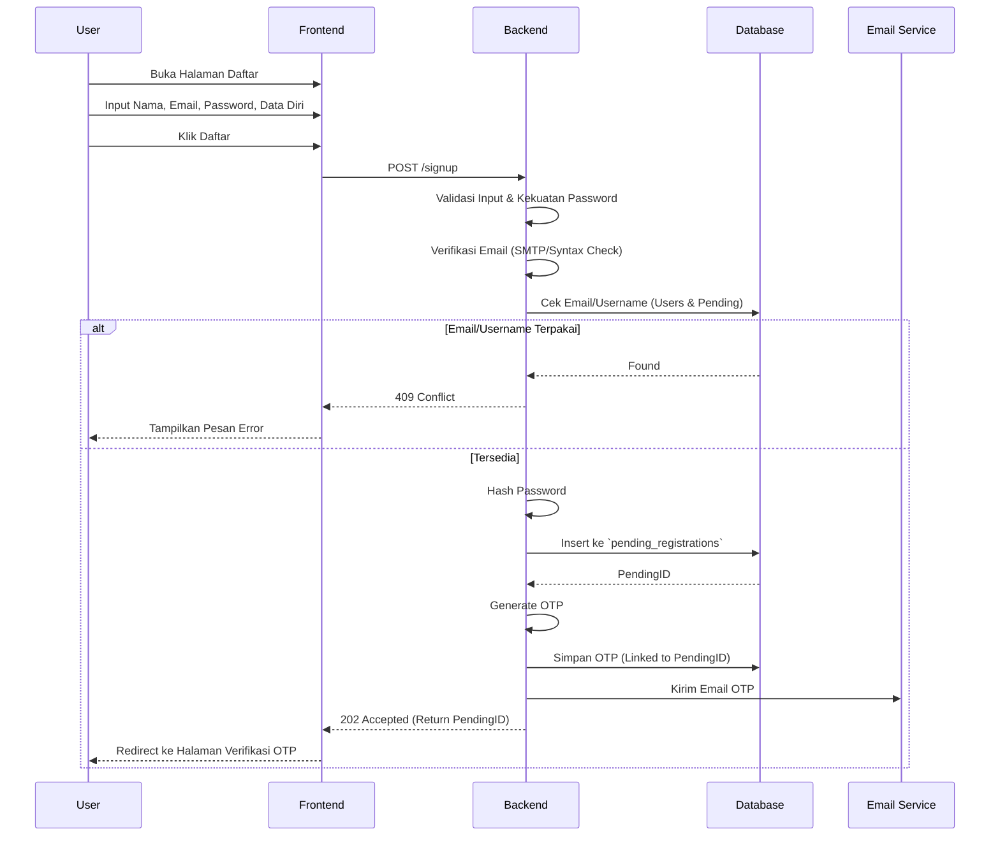
```mermaid
sequenceDiagram
    participant U as User
    participant FE as Frontend
    participant BE as Backend
    participant DB as Database
    participant MAIL as Email Service

    U->>FE: Buka Halaman Daftar
    U->>FE: Input Nama, Email, Password, Data Diri
    U->>FE: Klik Daftar
    FE->>BE: POST /signup
    BE->>BE: Validasi Input & Kekuatan Password
    BE->>BE: Verifikasi Email (SMTP/Syntax Check)
    BE->>DB: Cek Email/Username (Users & Pending)
    alt Email/Username Terpakai
        DB-->>BE: Found
        BE-->>FE: 409 Conflict
        FE-->>U: Tampilkan Pesan Error
    else Tersedia
        BE->>BE: Hash Password
        BE->>DB: Insert ke `pending_registrations`
        DB-->>BE: PendingID
        BE->>BE: Generate OTP
        BE->>DB: Simpan OTP (Linked to PendingID)
        BE->>MAIL: Kirim Email OTP
        BE-->>FE: 202 Accepted (Return PendingID)
        FE-->>U: Redirect ke Halaman Verifikasi OTP
    end
```

### 2. Login
*Ref: `auth.LoginHandler`*
Sistem menerapkan 2FA default. Login berhasil hanya memicu pengiriman OTP, bukan langsung memberi Token.
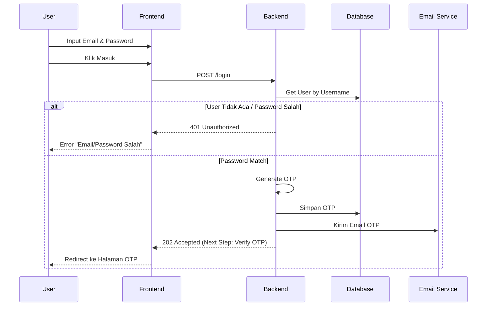
```mermaid
sequenceDiagram
    participant U as User
    participant FE as Frontend
    participant BE as Backend
    participant DB as Database
    participant MAIL as Email Service

    U->>FE: Input Email & Password
    U->>FE: Klik Masuk
    FE->>BE: POST /login
    BE->>DB: Get User by Username
    alt User Tidak Ada / Password Salah
        BE-->>FE: 401 Unauthorized
        FE-->>U: Error "Email/Password Salah"
    else Password Match
        BE->>BE: Generate OTP
        BE->>DB: Simpan OTP
        BE->>MAIL: Kirim Email OTP
        BE-->>FE: 202 Accepted (Next Step: Verify OTP)
        FE-->>U: Redirect ke Halaman OTP
    end
```

### 3. Login with Google
*Ref: `auth.MobileGoogleAuthHandler`*
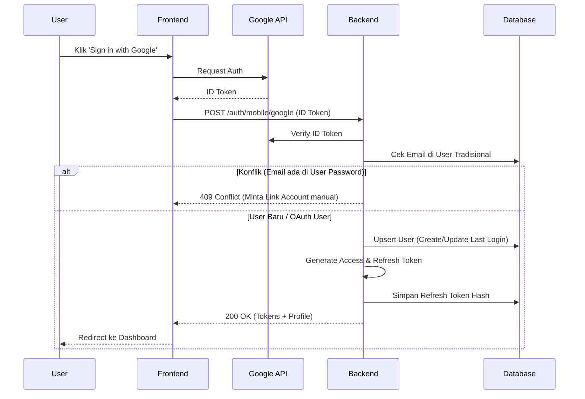
```mermaid
sequenceDiagram
    participant U as User
    participant FE as Frontend
    participant GOOG as Google API
    participant BE as Backend
    participant DB as Database

    U->>FE: Klik 'Sign in with Google'
    FE->>GOOG: Request Auth
    GOOG-->>FE: ID Token
    FE->>BE: POST /auth/mobile/google (ID Token)
    BE->>GOOG: Verify ID Token
    BE->>DB: Cek Email di User Tradisional
    alt Konflik (Email ada di User Password)
        BE-->>FE: 409 Conflict (Minta Link Account manual)
    else User Baru / OAuth User
        BE->>DB: Upsert User (Create/Update Last Login)
        BE->>BE: Generate Access & Refresh Token
        BE->>DB: Simpan Refresh Token Hash
        BE-->>FE: 200 OK (Tokens + Profile)
        FE-->>U: Redirect ke Dashboard
    end
```

### 4. Verify OTP
*Ref: `auth.VerifyOTPHandler`*
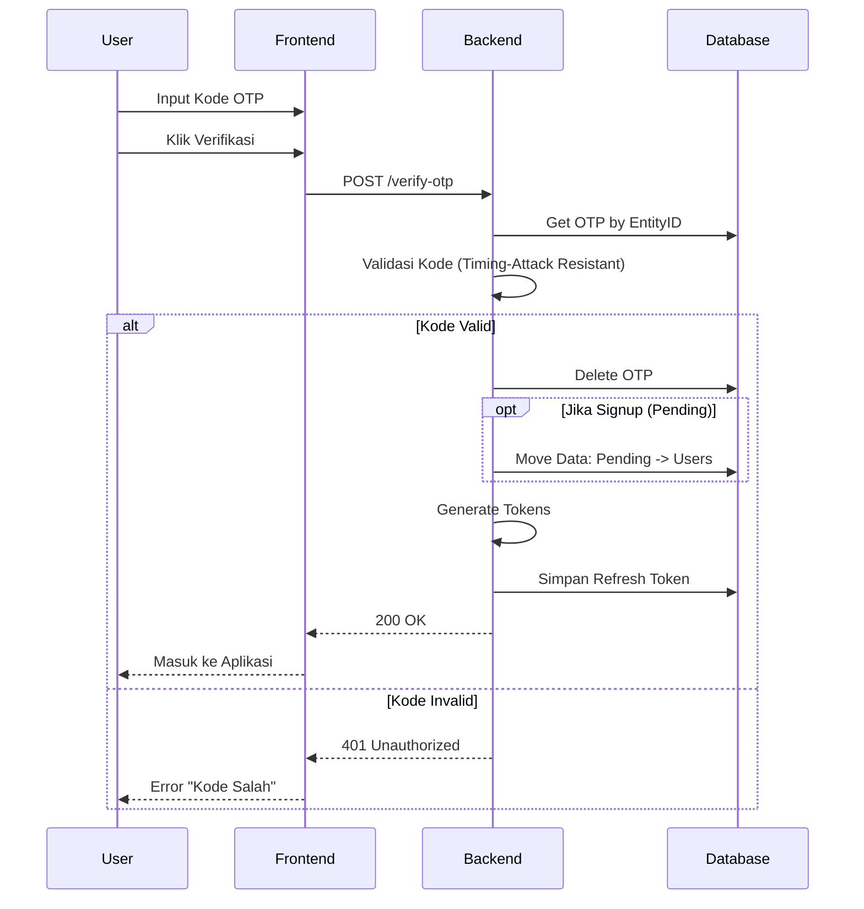
```mermaid
sequenceDiagram
    participant U as User
    participant FE as Frontend
    participant BE as Backend
    participant DB as Database

    U->>FE: Input Kode OTP
    U->>FE: Klik Verifikasi
    FE->>BE: POST /verify-otp
    BE->>DB: Get OTP by EntityID
    BE->>BE: Validasi Kode (Timing-Attack Resistant)
    alt Kode Valid
        BE->>DB: Delete OTP
        opt Jika Signup (Pending)
            BE->>DB: Move Data: Pending -> Users
        end
        BE->>BE: Generate Tokens
        BE->>DB: Simpan Refresh Token
        BE-->>FE: 200 OK
        FE-->>U: Masuk ke Aplikasi
    else Kode Invalid
        BE-->>FE: 401 Unauthorized
        FE-->>U: Error "Kode Salah"
    end
```

### 5. Resend OTP
*Ref: `auth.ResendOTPHandler`*
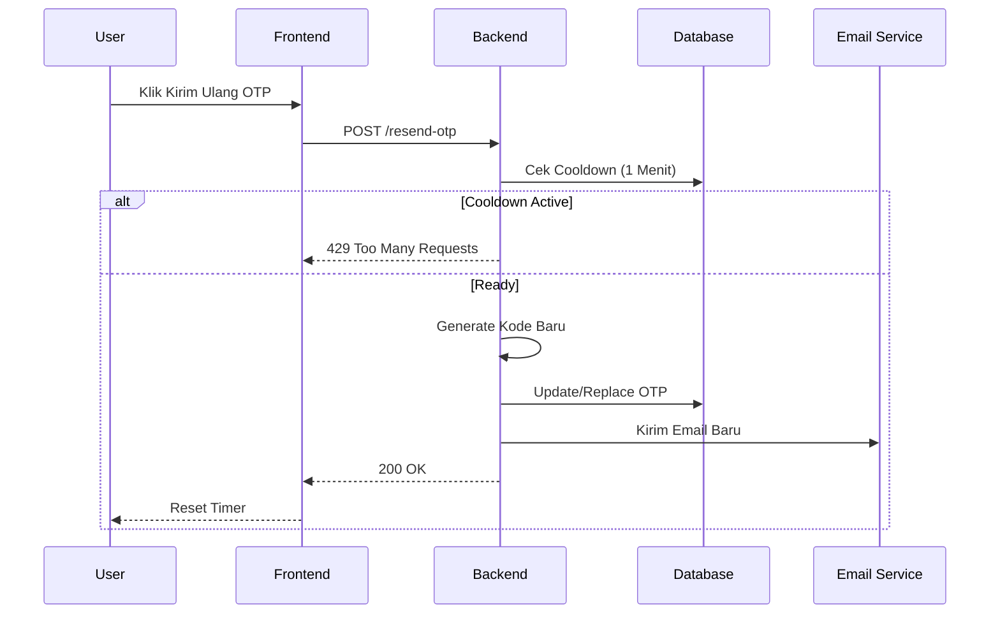
```mermaid
sequenceDiagram
    participant U as User
    participant FE as Frontend
    participant BE as Backend
    participant DB as Database
    participant MAIL as Email Service

    U->>FE: Klik Kirim Ulang OTP
    FE->>BE: POST /resend-otp
    BE->>DB: Cek Cooldown (1 Menit)
    alt Cooldown Active
        BE-->>FE: 429 Too Many Requests
    else Ready
        BE->>BE: Generate Kode Baru
        BE->>DB: Update/Replace OTP
        BE->>MAIL: Kirim Email Baru
        BE-->>FE: 200 OK
        FE-->>U: Reset Timer
    end
```

### 6. Reset Password
*Ref: `auth.RequestPasswordResetHandler` & `ResetPasswordHandler`*
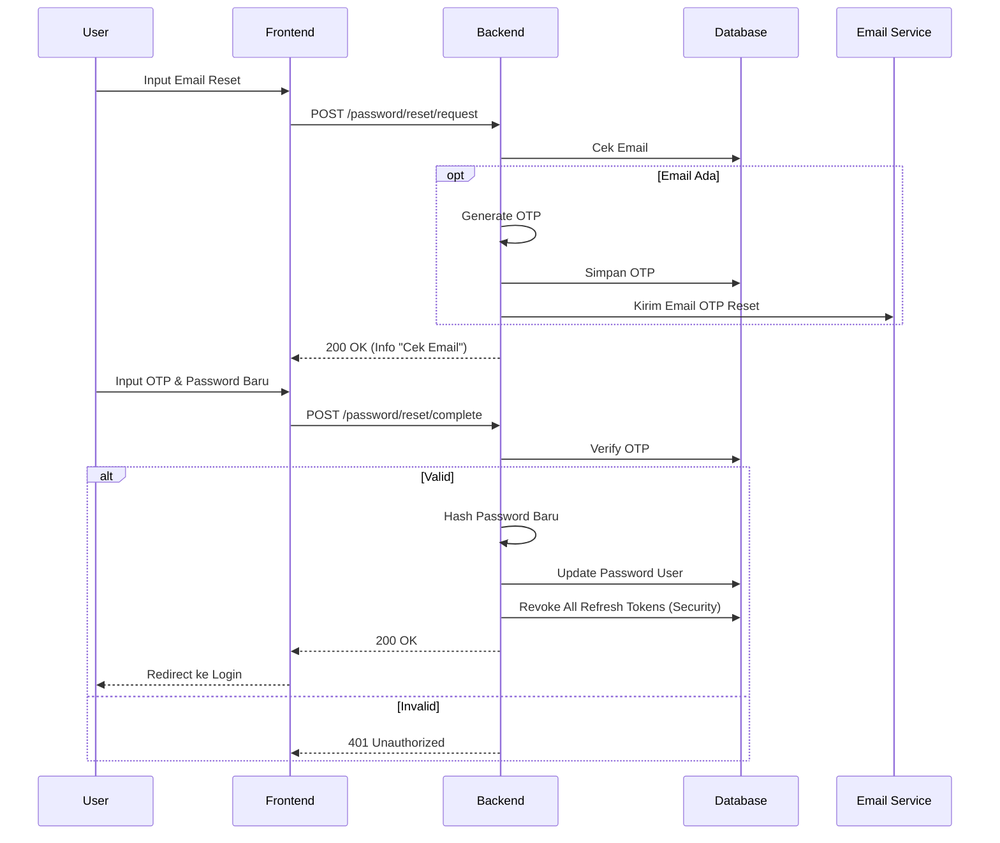
```mermaid
sequenceDiagram
    participant U as User
    participant FE as Frontend
    participant BE as Backend
    participant DB as Database
    participant MAIL as Email Service

    U->>FE: Input Email Reset
    FE->>BE: POST /password/reset/request
    BE->>DB: Cek Email
    opt Email Ada
        BE->>BE: Generate OTP
        BE->>DB: Simpan OTP
        BE->>MAIL: Kirim Email OTP Reset
    end
    BE-->>FE: 200 OK (Info "Cek Email")
    
    U->>FE: Input OTP & Password Baru
    FE->>BE: POST /password/reset/complete
    BE->>DB: Verify OTP
    alt Valid
        BE->>BE: Hash Password Baru
        BE->>DB: Update Password User
        BE->>DB: Revoke All Refresh Tokens (Security)
        BE-->>FE: 200 OK
        FE-->>U: Redirect ke Login
    else Invalid
        BE-->>FE: 401 Unauthorized
    end
```

---

## 2. Profile Management

### 7. Update Profile
*Ref: `user.UpdateUserProfileHandler`*
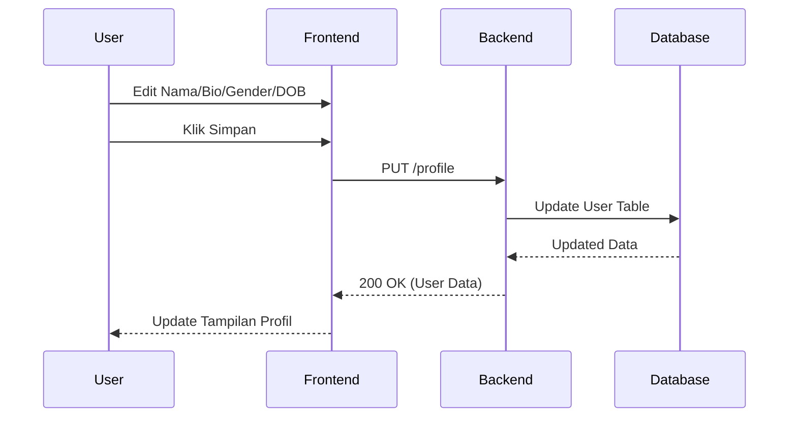
```mermaid
sequenceDiagram
    participant U as User
    participant FE as Frontend
    participant BE as Backend
    participant DB as Database

    U->>FE: Edit Nama/Bio/Gender/DOB
    U->>FE: Klik Simpan
    FE->>BE: PUT /profile
    BE->>DB: Update User Table
    DB-->>BE: Updated Data
    BE-->>FE: 200 OK (User Data)
    FE-->>U: Update Tampilan Profil
```

### 8. Update Password
*Ref: `user.UpdatePasswordHandler`*
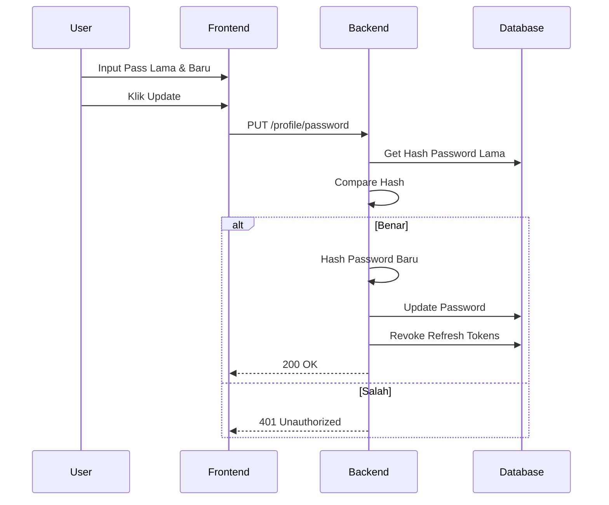
```mermaid
sequenceDiagram
    participant U as User
    participant FE as Frontend
    participant BE as Backend
    participant DB as Database

    U->>FE: Input Pass Lama & Baru
    U->>FE: Klik Update
    FE->>BE: PUT /profile/password
    BE->>DB: Get Hash Password Lama
    BE->>BE: Compare Hash
    alt Benar
        BE->>BE: Hash Password Baru
        BE->>DB: Update Password
        BE->>DB: Revoke Refresh Tokens
        BE-->>FE: 200 OK
    else Salah
        BE-->>FE: 401 Unauthorized
    end
```

### 9. Update Email
*Ref: `user.RequestEmailChangeHandler`*
Tidak langsung ganti, tapi kirim link verifikasi ke email baru.
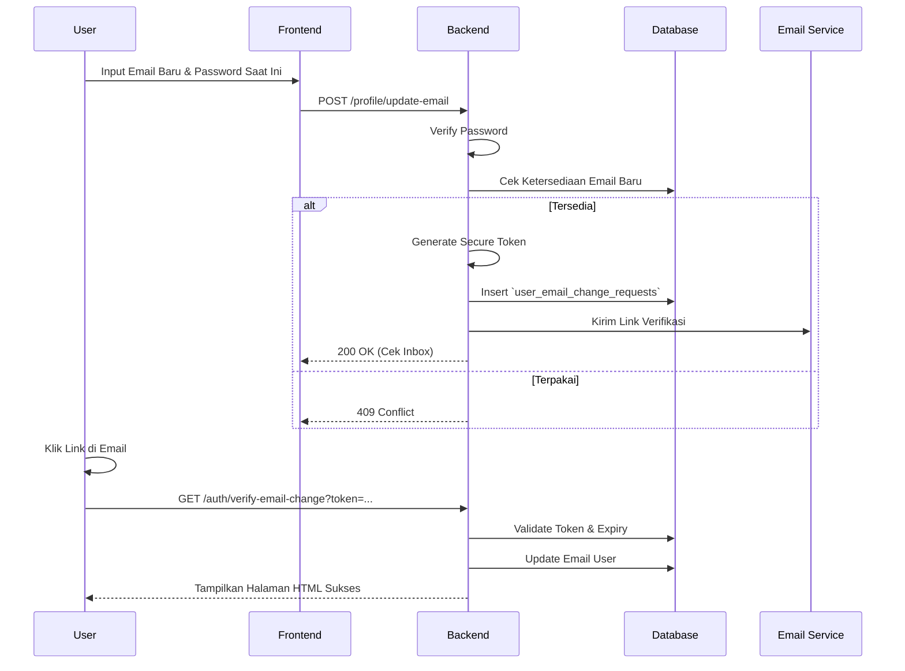
```mermaid
sequenceDiagram
    participant U as User
    participant FE as Frontend
    participant BE as Backend
    participant DB as Database
    participant MAIL as Email Service

    U->>FE: Input Email Baru & Password Saat Ini
    FE->>BE: POST /profile/update-email
    BE->>BE: Verify Password
    BE->>DB: Cek Ketersediaan Email Baru
    alt Tersedia
        BE->>BE: Generate Secure Token
        BE->>DB: Insert `user_email_change_requests`
        BE->>MAIL: Kirim Link Verifikasi
        BE-->>FE: 200 OK (Cek Inbox)
    else Terpakai
        BE-->>FE: 409 Conflict
    end

    U->>U: Klik Link di Email
    U->>BE: GET /auth/verify-email-change?token=...
    BE->>DB: Validate Token & Expiry
    BE->>DB: Update Email User
    BE-->>U: Tampilkan Halaman HTML Sukses
```

### 10. Update Username
*Ref: `user.UpdateUsernameHandler`*
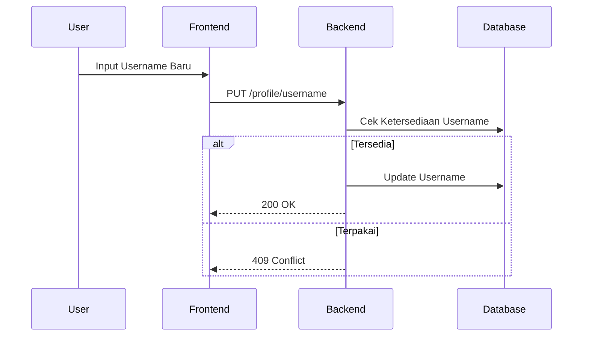
```mermaid
sequenceDiagram
    participant U as User
    participant FE as Frontend
    participant BE as Backend
    participant DB as Database

    U->>FE: Input Username Baru
    FE->>BE: PUT /profile/username
    BE->>DB: Cek Ketersediaan Username
    alt Tersedia
        BE->>DB: Update Username
        BE-->>FE: 200 OK
    else Terpakai
        BE-->>FE: 409 Conflict
    end
```

### 11. Delete Account
*Ref: `user.DeleteAccountHandler`*
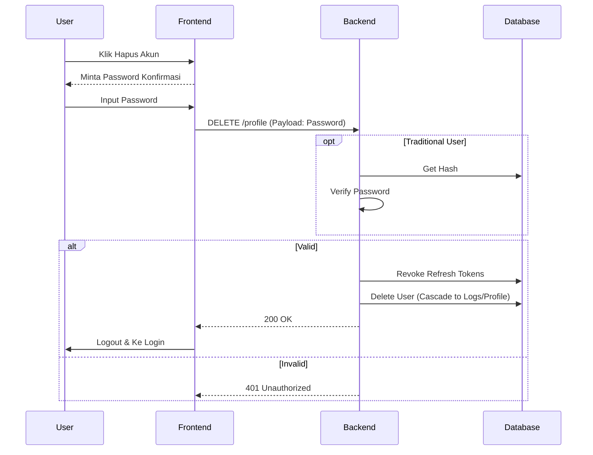
```mermaid
sequenceDiagram
    participant U as User
    participant FE as Frontend
    participant BE as Backend
    participant DB as Database

    U->>FE: Klik Hapus Akun
    FE-->>U: Minta Password Konfirmasi
    U->>FE: Input Password
    FE->>BE: DELETE /profile (Payload: Password)
    
    opt Traditional User
        BE->>DB: Get Hash
        BE->>BE: Verify Password
    end
    
    alt Valid
        BE->>DB: Revoke Refresh Tokens
        BE->>DB: Delete User (Cascade to Logs/Profile)
        BE-->>FE: 200 OK
        FE->>U: Logout & Ke Login
    else Invalid
        BE-->>FE: 401 Unauthorized
    end
```

### 12. Link Google Account
*Ref: `auth.LinkGoogleAccountHandler`*
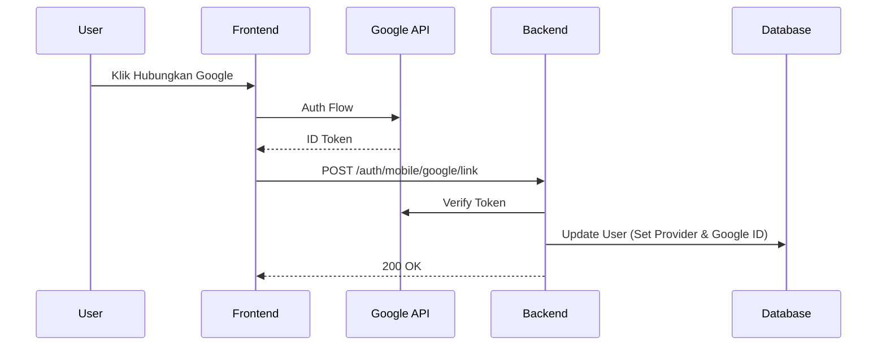
```mermaid
sequenceDiagram
    participant U as User
    participant FE as Frontend
    participant GOOG as Google API
    participant BE as Backend
    participant DB as Database

    U->>FE: Klik Hubungkan Google
    FE->>GOOG: Auth Flow
    GOOG-->>FE: ID Token
    FE->>BE: POST /auth/mobile/google/link
    BE->>GOOG: Verify Token
    BE->>DB: Update User (Set Provider & Google ID)
    BE-->>FE: 200 OK
```

### 13. Unlink Google Account
*Ref: `auth.UnlinkGoogleAccountHandler`*
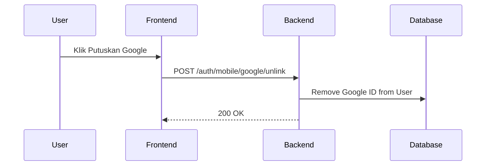
```mermaid
sequenceDiagram
    participant U as User
    participant FE as Frontend
    participant BE as Backend
    participant DB as Database

    U->>FE: Klik Putuskan Google
    FE->>BE: POST /auth/mobile/google/unlink
    BE->>DB: Remove Google ID from User
    BE-->>FE: 200 OK
```

---

## 3. Address Management

### 14. View Address List
*Ref: `user.GetAddressesHandler`*
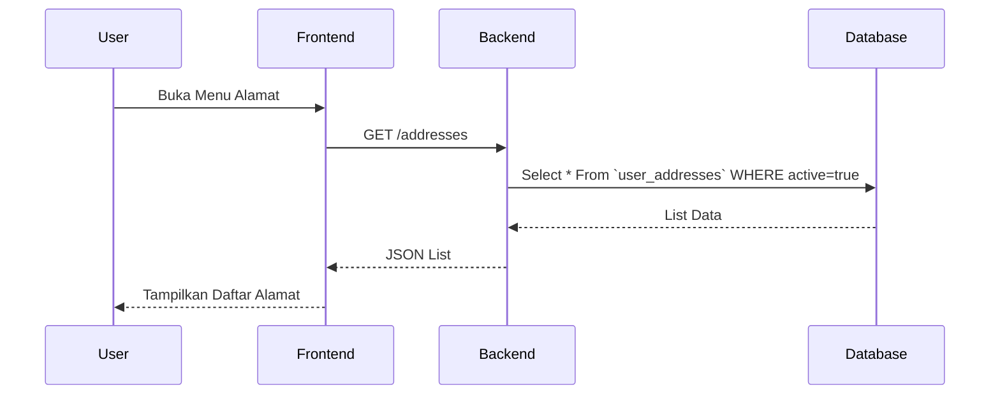
```mermaid
sequenceDiagram
    participant U as User
    participant FE as Frontend
    participant BE as Backend
    participant DB as Database

    U->>FE: Buka Menu Alamat
    FE->>BE: GET /addresses
    BE->>DB: Select * From `user_addresses` WHERE active=true
    DB-->>BE: List Data
    BE-->>FE: JSON List
    FE-->>U: Tampilkan Daftar Alamat
```

### 15. Insert Address
*Ref: `user.CreateAddressHandler`*
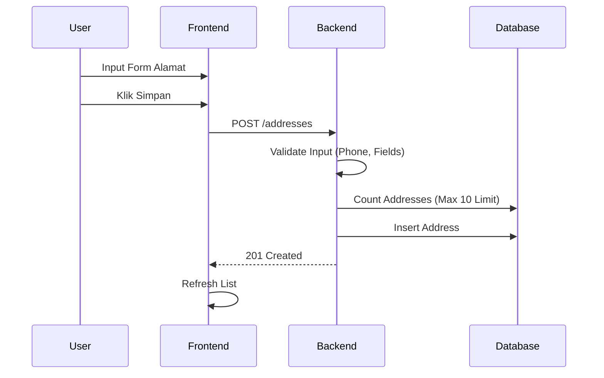
```mermaid
sequenceDiagram
    participant U as User
    participant FE as Frontend
    participant BE as Backend
    participant DB as Database

    U->>FE: Input Form Alamat
    U->>FE: Klik Simpan
    FE->>BE: POST /addresses
    BE->>BE: Validate Input (Phone, Fields)
    BE->>DB: Count Addresses (Max 10 Limit)
    BE->>DB: Insert Address
    BE-->>FE: 201 Created
    FE->>FE: Refresh List
```

### 16. Update Address
*Ref: `user.UpdateAddressHandler`*
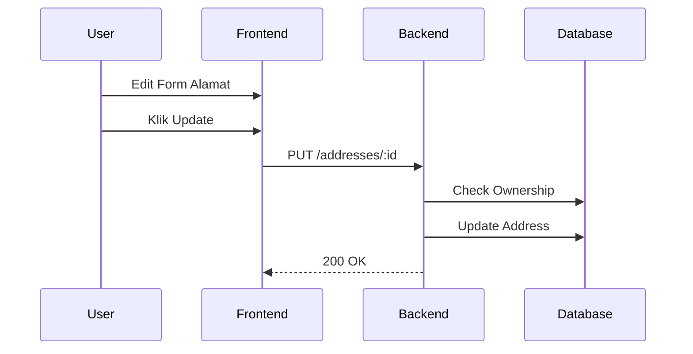
```mermaid
sequenceDiagram
    participant U as User
    participant FE as Frontend
    participant BE as Backend
    participant DB as Database

    U->>FE: Edit Form Alamat
    U->>FE: Klik Update
    FE->>BE: PUT /addresses/:id
    BE->>DB: Check Ownership
    BE->>DB: Update Address
    BE-->>FE: 200 OK
```

### 17. Set Default Address
*Ref: `user.SetDefaultAddressHandler`*
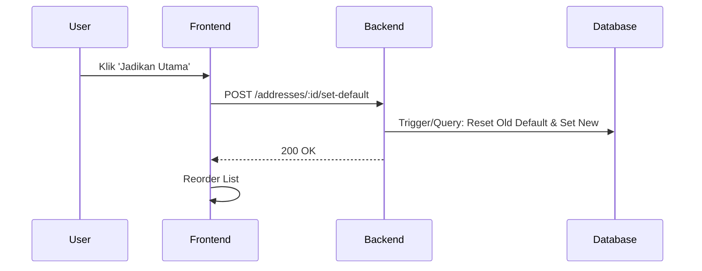
```mermaid
sequenceDiagram
    participant U as User
    participant FE as Frontend
    participant BE as Backend
    participant DB as Database

    U->>FE: Klik 'Jadikan Utama'
    FE->>BE: POST /addresses/:id/set-default
    BE->>DB: Trigger/Query: Reset Old Default & Set New
    BE-->>FE: 200 OK
    FE->>FE: Reorder List
```

### 18. Delete Address
*Ref: `user.DeleteAddressHandler`*
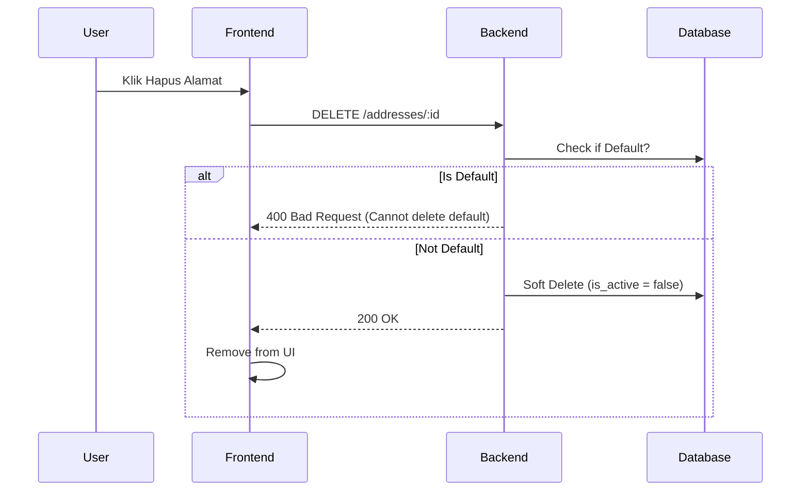
```mermaid
sequenceDiagram
    participant U as User
    participant FE as Frontend
    participant BE as Backend
    participant DB as Database

    U->>FE: Klik Hapus Alamat
    FE->>BE: DELETE /addresses/:id
    BE->>DB: Check if Default?
    alt Is Default
        BE-->>FE: 400 Bad Request (Cannot delete default)
    else Not Default
        BE->>DB: Soft Delete (is_active = false)
        BE-->>FE: 200 OK
        FE->>FE: Remove from UI
    end
```

---

## 4. Cart & Order

### 19. View Cart
*Ref: `user.GetCartHandler`*
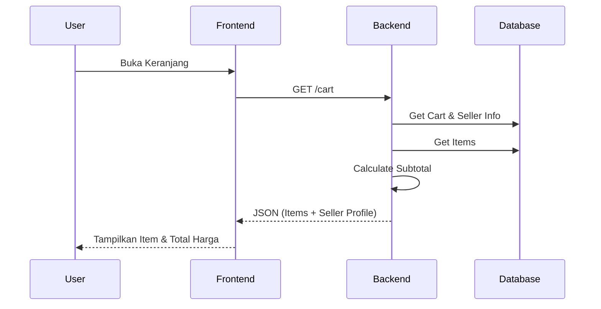
```mermaid
sequenceDiagram
    participant U as User
    participant FE as Frontend
    participant BE as Backend
    participant DB as Database

    U->>FE: Buka Keranjang
    FE->>BE: GET /cart
    BE->>DB: Get Cart & Seller Info
    BE->>DB: Get Items
    BE->>BE: Calculate Subtotal
    BE-->>FE: JSON (Items + Seller Profile)
    FE-->>U: Tampilkan Item & Total Harga
```

### 20. Add Item to Cart
*Ref: `user.AddItemToCartHandler`*
Validasi: Keranjang hanya boleh berisi item dari 1 penjual.
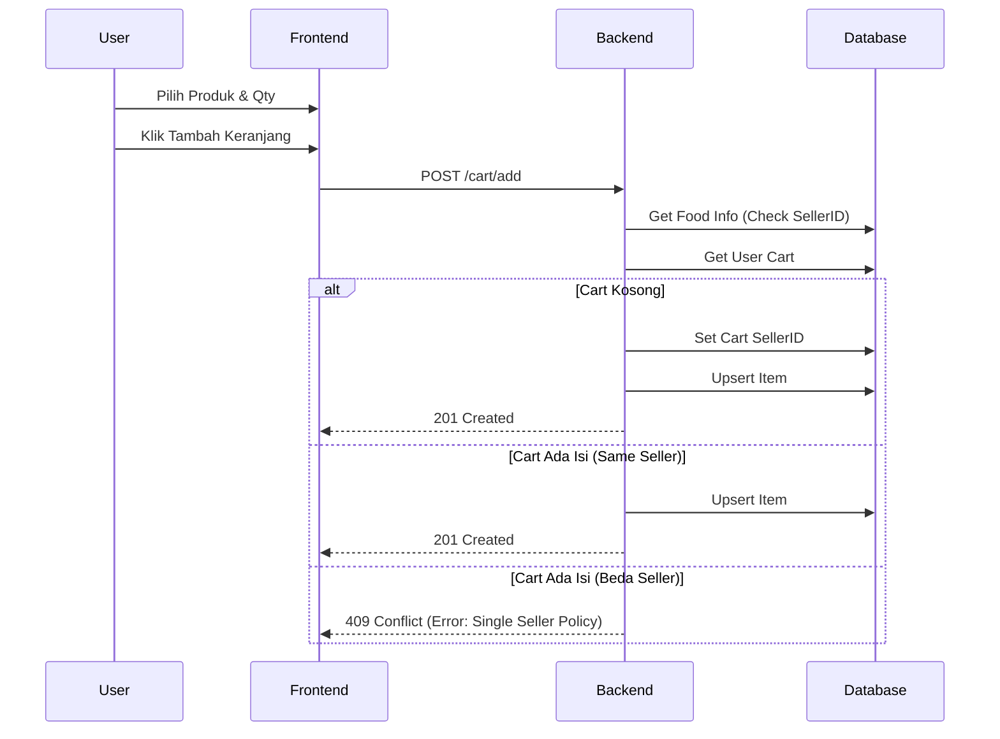
```mermaid
sequenceDiagram
    participant U as User
    participant FE as Frontend
    participant BE as Backend
    participant DB as Database

    U->>FE: Pilih Produk & Qty
    U->>FE: Klik Tambah Keranjang
    FE->>BE: POST /cart/add
    BE->>DB: Get Food Info (Check SellerID)
    BE->>DB: Get User Cart
    
    alt Cart Kosong
        BE->>DB: Set Cart SellerID
        BE->>DB: Upsert Item
        BE-->>FE: 201 Created
    else Cart Ada Isi (Same Seller)
        BE->>DB: Upsert Item
        BE-->>FE: 201 Created
    else Cart Ada Isi (Beda Seller)
        BE-->>FE: 409 Conflict (Error: Single Seller Policy)
    end
```

### 21. Update Item Quantity
*Ref: `user.UpdateCartItemHandler`*
```mermaid
sequenceDiagram
    participant U as User
    participant FE as Frontend
    participant BE as Backend
    participant DB as Database

    U->>FE: Klik (+) atau (-)
    FE->>BE: PUT /cart/update
    BE->>DB: Update Qty
    BE-->>FE: 200 OK
    FE-->>U: Update Tampilan Harga
```

### 22. Remove Item from Cart
*Ref: `user.RemoveItemFromCartHandler`*
```mermaid
sequenceDiagram
    participant U as User
    participant FE as Frontend
    participant BE as Backend
    participant DB as Database

    U->>FE: Geser/Klik Hapus Item
    FE->>BE: POST /cart/remove
    BE->>DB: Delete Cart Item
    BE->>DB: Check if Cart Empty
    opt Empty
        BE->>DB: Clear Cart SellerID
    end
    BE-->>FE: 200 OK
    FE-->>U: Hapus Item dari List
```

### 23. Checkout Cart
*Ref: `user.CheckoutHandler`*
```mermaid
sequenceDiagram
    participant U as User
    participant FE as Frontend
    participant BE as Backend
    participant DB as Database

    U->>FE: Klik Checkout
    U->>FE: Pilih Alamat & Payment
    U->>FE: Klik Buat Pesanan
    FE->>BE: POST /checkout
    BE->>DB: Begin Transaction
    BE->>DB: Snapshot Address JSON
    
    loop Per Item
        BE->>DB: Lock Food Row (Stock Check)
        alt Stock Available
            BE->>BE: Calc Price
        else Out of Stock
            BE->>DB: Rollback
            BE-->>FE: 409 Conflict
        end
    end

    BE->>DB: Insert Order Header
    BE->>DB: Insert Order Items (Snapshot Data)
    BE->>DB: Clear Cart
    BE->>DB: Commit Transaction
    BE-->>FE: 201 Created (Order Response)
    FE-->>U: Redirect ke Payment
```

### 24. Order Payment
*Ref: External Payment Gateway (Simulated)*
```mermaid
sequenceDiagram
    participant U as User
    participant FE as Frontend
    participant BE as Backend
    participant DB as Database
    participant PG as Payment Gateway

    U->>FE: Pilih Metode Bayar
    FE->>PG: Init Payment
    U->>PG: Transfer / E-Wallet
    PG-->>FE: Payment Success Callback
    FE->>BE: Notify Payment Success (Webhook/Callback)
    BE->>DB: Update Order Status (Paid)
    BE-->>FE: 200 OK
    FE-->>U: Tampilkan Struk
```

### 25. Track Order Status
*Ref: `GetUserOrders`*
```mermaid
sequenceDiagram
    participant U as User
    participant FE as Frontend
    participant BE as Backend
    participant DB as Database

    U->>FE: Buka Detail Pesanan
    FE->>BE: GET /user/data (atau specific endpoint)
    BE->>DB: Select Orders
    BE-->>FE: Order List & Status
    FE-->>U: Tampilkan Status (Processing/Shipped/etc)
```

---

## 5. Health Records

### A. Health Profile

#### 26. Input Health Profile (Initial)
*Ref: `user.UpsertHealthProfileHandler`*
```mermaid
sequenceDiagram
    participant U as User
    participant FE as Frontend
    participant BE as Backend
    participant DB as Database

    U->>FE: Input PageView (Tinggi, Berat, Diabetes Type)
    U->>FE: Klik Simpan
    FE->>BE: PUT /health/profile
    BE->>BE: Validate Mandatory Fields
    BE->>BE: Calculate Years with Condition
    BE->>DB: Upsert `user_health_profiles`
    BE-->>FE: 200 OK
    FE-->>U: Redirect Home
```

#### 27. View Health Profile
*Ref: `user.GetHealthProfileHandler`*
```mermaid
sequenceDiagram
    participant U as User
    participant FE as Frontend
    participant BE as Backend
    participant DB as Database

    U->>FE: Buka Menu Profil Kesehatan
    FE->>BE: GET /health/profile
    BE->>DB: Fetch Data
    BE-->>FE: Profile Data (BMI, dll)
    FE-->>U: Tampilkan Data
```

#### 28. Update Health Profile
*Ref: `user.UpsertHealthProfileHandler`*
```mermaid
sequenceDiagram
    participant U as User
    participant FE as Frontend
    participant BE as Backend
    participant DB as Database

    U->>FE: Edit Profil (BB/TB)
    U->>FE: Klik Simpan
    FE->>BE: PUT /health/profile
    BE->>DB: Upsert Row (Update existing)
    BE-->>FE: 200 OK
    FE-->>U: Refresh Tampilan
```

### B. HbA1c Record

#### 29. Input HbA1c
*Ref: `user.CreateHBA1CRecordHandler`*
```mermaid
sequenceDiagram
    participant U as User
    participant FE as Frontend
    participant BE as Backend
    participant DB as Database

    U->>FE: Input Nilai & Tanggal
    U->>FE: Klik Simpan
    FE->>BE: POST /health/hba1c
    BE->>DB: Insert Data
    BE-->>FE: 201 Created
```

#### 30. View HbA1c History
*Ref: `user.GetHBA1CRecordsHandler`*
```mermaid
sequenceDiagram
    participant U as User
    participant FE as Frontend
    participant BE as Backend
    participant DB as Database

    U->>FE: Buka Menu HbA1c
    FE->>BE: GET /health/hba1c
    BE->>DB: Select Data
    BE-->>FE: JSON List
    FE-->>U: Tampilkan Grafik
```

#### 31. Update HbA1c
*Ref: `user.UpdateHBA1CRecordHandler`*
```mermaid
sequenceDiagram
    participant U as User
    participant FE as Frontend
    participant BE as Backend
    participant DB as Database

    U->>FE: Pilih Item
    U->>FE: Ubah Nilai
    U->>FE: Klik Update
    FE->>BE: PUT /health/hba1c/:id
    BE->>DB: Update Data
    BE-->>FE: 200 OK
```

#### 32. Delete HbA1c
*Ref: `user.DeleteHBA1CRecordHandler`*
```mermaid
sequenceDiagram
    participant U as User
    participant FE as Frontend
    participant BE as Backend
    participant DB as Database

    U->>FE: Geser Item (Swipe)
    U->>FE: Klik Hapus
    FE->>BE: DELETE /health/hba1c/:id
    BE->>DB: Delete Row
    BE-->>FE: 204 No Content
```

### C. Health Event

#### 33. Input Health Event
*Ref: `user.CreateHealthEventHandler`*
```mermaid
sequenceDiagram
    participant U as User
    participant FE as Frontend
    participant BE as Backend
    participant DB as Database

    U->>FE: Pilih Gejala & Intensitas
    U->>FE: Klik Simpan
    FE->>BE: POST /health/events
    BE->>DB: Insert Data
    BE-->>FE: 201 Created
```

#### 34. View Health Event History
*Ref: `user.GetHealthEventsHandler`*
```mermaid
sequenceDiagram
    participant U as User
    participant FE as Frontend
    participant BE as Backend
    participant DB as Database

    U->>FE: Buka Log Keluhan
    FE->>BE: GET /health/events
    BE->>DB: Fetch Data
    BE-->>FE: Event List
    FE-->>U: Tampilkan Daftar
```

#### 35. Update Health Event
*Ref: `user.UpdateHealthEventHandler`*
```mermaid
sequenceDiagram
    participant U as User
    participant FE as Frontend
    participant BE as Backend
    participant DB as Database

    U->>FE: Pilih Keluhan
    U->>FE: Ubah Detail
    U->>FE: Klik Update
    FE->>BE: PUT /health/events/:id
    BE->>DB: Update Row
    BE-->>FE: 200 OK
```

#### 36. Delete Health Event
*Ref: `user.DeleteHealthEventHandler`*
```mermaid
sequenceDiagram
    participant U as User
    participant FE as Frontend
    participant BE as Backend
    participant DB as Database

    U->>FE: Geser Keluhan (Swipe)
    U->>FE: Klik Hapus
    FE->>BE: DELETE /health/events/:id
    BE->>DB: Remove Row
    BE-->>FE: 204 No Content
```

### D. Glucose Reading

#### 37. Input Glucose
*Ref: `user.CreateGlucoseReadingHandler`*
Includes backend analysis for flags.
```mermaid
sequenceDiagram
    participant U as User
    participant FE as Frontend
    participant BE as Backend
    participant DB as Database

    U->>FE: Input Angka, Waktu, Kategori
    U->>FE: Klik Simpan
    FE->>BE: POST /health/glucose
    BE->>DB: Get Health Profile (Targets)
    BE->>DB: Get Stats (Mean/StdDev)
    BE->>BE: Analyze (Check Hypo/Outlier/Flags)
    BE->>DB: Insert Data (with Flags)
    BE-->>FE: 201 Created (Data + Analysis Flags)
    opt Flagged
        FE-->>U: Tampilkan Alert (e.g. Hypoglycemia)
    end
```

#### 38. View Glucose History/Graph
*Ref: `user.GetGlucoseReadingsHandler`*
```mermaid
sequenceDiagram
    participant U as User
    participant FE as Frontend
    participant BE as Backend
    participant DB as Database

    U->>FE: Buka Glukosa
    FE->>BE: GET /health/glucose
    BE->>DB: Select Data (Date Range)
    BE-->>FE: JSON List
    FE-->>U: Tampilkan Grafik
```

#### 39. Update Glucose
*Ref: `user.UpdateGlucoseReadingHandler`*
```mermaid
sequenceDiagram
    participant U as User
    participant FE as Frontend
    participant BE as Backend
    participant DB as Database

    U->>FE: Pilih Data Glukosa
    U->>FE: Ubah Nilai
    U->>FE: Klik Update
    FE->>BE: PUT /health/glucose/:id
    BE->>DB: Update Data
    BE-->>FE: 200 OK
```

#### 40. Delete Glucose
*Ref: `user.DeleteGlucoseReadingHandler`*
```mermaid
sequenceDiagram
    participant U as User
    participant FE as Frontend
    participant BE as Backend
    participant DB as Database

    U->>FE: Geser Data Glukosa (Swipe)
    U->>FE: Klik Hapus
    FE->>BE: DELETE /health/glucose/:id
    BE->>DB: Remove Data
    BE-->>FE: 204 No Content
```

### E. Activity Logs

#### 41. View Activity Types
*Ref: `user.GetActivityTypesHandler`*
```mermaid
sequenceDiagram
    participant U as User
    participant FE as Frontend
    participant BE as Backend
    participant DB as Database

    U->>FE: Buka Menu Aktivitas
    FE->>BE: GET /health/activity_type
    BE->>DB: Fetch Master Activity Types
    BE-->>FE: JSON List
    FE-->>U: Tampilkan Pilihan
```

#### 42. Input Activity Log
*Ref: `user.CreateActivityLogHandler`*
```mermaid
sequenceDiagram
    participant U as User
    participant FE as Frontend
    participant BE as Backend
    participant DB as Database

    U->>FE: Pilih Tipe, Durasi, Intensitas
    U->>FE: Klik Simpan
    FE->>BE: POST /health/log/activity
    BE->>DB: Insert Log
    BE-->>FE: 201 Created
```

#### 43. View Activity History
*Ref: `user.GetActivityLogsHandler`*
```mermaid
sequenceDiagram
    participant U as User
    participant FE as Frontend
    participant BE as Backend
    participant DB as Database

    U->>FE: Buka Riwayat Aktivitas
    FE->>BE: GET /health/log/activity
    BE->>DB: Fetch Logs
    BE-->>FE: Log List
    FE-->>U: Tampilkan Riwayat
```

#### 44. Update Activity Log
*Ref: `user.UpdateActivityLogHandler`*
```mermaid
sequenceDiagram
    participant U as User
    participant FE as Frontend
    participant BE as Backend
    participant DB as Database

    U->>FE: Pilih Item Riwayat
    U->>FE: Ubah Durasi
    U->>FE: Klik Update
    FE->>BE: PUT /health/log/activity/:id
    BE->>DB: Update Row
    BE-->>FE: 200 OK
```

#### 45. Delete Activity Log
*Ref: `user.DeleteActivityLogHandler`*
```mermaid
sequenceDiagram
    participant U as User
    participant FE as Frontend
    participant BE as Backend
    participant DB as Database

    U->>FE: Geser Aktivitas (Swipe)
    U->>FE: Klik Hapus
    FE->>BE: DELETE /health/log/activity/:id
    BE->>DB: Remove Row
    BE-->>FE: 204 No Content
```

### F. Sleep Logs

#### 46. View Sleep Dashboard
*Ref: `user.GetSleepLogsHandler`*
```mermaid
sequenceDiagram
    participant U as User
    participant FE as Frontend
    participant BE as Backend
    participant DB as Database

    U->>FE: Buka Menu Tidur
    FE->>BE: GET /health/log/sleep
    BE->>DB: Fetch Sleep Data
    BE-->>FE: List Data
    FE-->>U: Tampilkan Dashboard
```

#### 47. Input Sleep Log
*Ref: `user.CreateSleepLogHandler`*
```mermaid
sequenceDiagram
    participant U as User
    participant FE as Frontend
    participant BE as Backend
    participant DB as Database

    U->>FE: Set Jam Tidur & Bangun
    U->>FE: Klik Simpan
    FE->>BE: POST /health/log/sleep
    BE->>BE: Parse Times (RFC3339)
    BE->>DB: Insert Log
    BE-->>FE: 201 Created
```

#### 48. Update Sleep Log
*Ref: `user.UpdateSleepLogHandler`*
```mermaid
sequenceDiagram
    participant U as User
    participant FE as Frontend
    participant BE as Backend
    participant DB as Database

    U->>FE: Pilih Log
    U->>FE: Ubah Waktu
    U->>FE: Klik Update
    FE->>BE: PUT /health/log/sleep/:id
    BE->>DB: Update Data
    BE-->>FE: 200 OK
```

#### 49. Delete Sleep Log
*Ref: `user.DeleteSleepLogHandler`*
```mermaid
sequenceDiagram
    participant U as User
    participant FE as Frontend
    participant BE as Backend
    participant DB as Database

    U->>FE: Geser Data Tidur
    U->>FE: Klik Hapus
    FE->>BE: DELETE /health/log/sleep/:id
    BE->>DB: Remove Data
    BE-->>FE: 204 No Content
```

### G. Medication (List)

#### 50. Input Medication
*Ref: `user.CreateUserMedicationHandler`*
```mermaid
sequenceDiagram
    participant U as User
    participant FE as Frontend
    participant BE as Backend
    participant DB as Database

    U->>FE: Input Nama, Tipe, Dosis Default
    U->>FE: Klik Simpan
    FE->>BE: POST /health/medication
    BE->>DB: Insert `user_medications` (Config)
    BE-->>FE: 201 Created
```

#### 51. View Medication List
*Ref: `user.GetUserMedicationsHandler`*
```mermaid
sequenceDiagram
    participant U as User
    participant FE as Frontend
    participant BE as Backend
    participant DB as Database

    U->>FE: Buka Daftar Obat
    FE->>BE: GET /health/medication
    BE->>DB: Fetch Active Medications
    BE-->>FE: JSON List
    FE-->>U: Tampilkan List
```

#### 52. Update Medication
*Ref: `user.UpdateUserMedicationHandler`*
```mermaid
sequenceDiagram
    participant U as User
    participant FE as Frontend
    participant BE as Backend
    participant DB as Database

    U->>FE: Pilih Obat
    U->>FE: Edit Data
    U->>FE: Klik Update
    FE->>BE: PUT /health/medication/:id
    BE->>DB: Update Row
    BE-->>FE: 200 OK
```

#### 53. Delete Medication
*Ref: `user.DeleteUserMedicationHandler`*
```mermaid
sequenceDiagram
    participant U as User
    participant FE as Frontend
    participant BE as Backend
    participant DB as Database

    U->>FE: Klik Hapus
    FE->>BE: DELETE /health/medication/:id
    BE->>DB: Soft Delete (set active=false)
    BE-->>FE: 204 No Content
```

### H. Medication Logs (History)

#### 54. Input Medication Log (Minum)
*Ref: `user.CreateMedicationLogHandler`*
```mermaid
sequenceDiagram
    participant U as User
    participant FE as Frontend
    participant BE as Backend
    participant DB as Database

    U->>FE: Pilih Obat dari Daftar
    U->>FE: Input Dosis & Waktu
    U->>FE: Klik Simpan
    FE->>BE: POST /health/log/medication
    BE->>DB: Insert `user_medication_logs`
    BE-->>FE: 201 Created
```

#### 55. View Medication History
*Ref: `user.GetMedicationLogsHandler`*
```mermaid
sequenceDiagram
    participant U as User
    participant FE as Frontend
    participant BE as Backend
    participant DB as Database

    U->>FE: Buka Riwayat Obat
    FE->>BE: GET /health/log/medication
    BE->>DB: Fetch Logs
    BE-->>FE: Log List
    FE-->>U: Tampilkan Riwayat
```

#### 56. Update Medication Log
*Ref: `user.UpdateMedicationLogHandler`*
```mermaid
sequenceDiagram
    participant U as User
    participant FE as Frontend
    participant BE as Backend
    participant DB as Database

    U->>FE: Pilih Log Minum
    U->>FE: Edit Data
    U->>FE: Klik Update
    FE->>BE: PUT /health/log/medication/:id
    BE->>DB: Update Log
    BE-->>FE: 200 OK
```

#### 57. Delete Medication Log
*Ref: `user.DeleteMedicationLogHandler`*
```mermaid
sequenceDiagram
    participant U as User
    participant FE as Frontend
    participant BE as Backend
    participant DB as Database

    U->>FE: Geser Log
    U->>FE: Klik Hapus
    FE->>BE: DELETE /health/log/medication/:id
    BE->>DB: Remove Log
    BE-->>FE: 204 No Content
```

### I. Meal Logs

#### 58. Input Meal Log
*Ref: `user.CreateMealLogHandler`*
Includes Header (Meal Info) and Items (Foods).
```mermaid
sequenceDiagram
    participant U as User
    participant FE as Frontend
    participant BE as Backend
    participant DB as Database

    U->>FE: Input Info Makan (Waktu, Tipe)
    U->>FE: Tambah Item Makanan (dari DB/Manual)
    U->>FE: Klik Simpan
    FE->>BE: POST /health/log/meal
    BE->>DB: Calculate Totals (Carbs/Cals)
    BE->>DB: Insert Meal Header
    BE->>DB: Insert Meal Items (Batch)
    BE-->>FE: 201 Created
```

#### 59. View Meal Diary
*Ref: `user.GetAllMealLogsHandler`*
```mermaid
sequenceDiagram
    participant U as User
    participant FE as Frontend
    participant BE as Backend
    participant DB as Database

    U->>FE: Buka Diary Makanan
    FE->>BE: GET /health/log/meals
    BE->>DB: Fetch Headers
    loop For Each Meal
        BE->>DB: Fetch Items
    end
    BE-->>FE: Meal List with Items
    FE-->>U: Tampilkan Diary
```

#### 60. Update Meal Log
*Ref: `user.UpdateMealLogHandler`*
```mermaid
sequenceDiagram
    participant U as User
    participant FE as Frontend
    participant BE as Backend
    participant DB as Database

    U->>FE: Edit Meal Log
    FE->>BE: PUT /health/log/meal/:id
    BE->>DB: Update Header
    BE->>DB: Sync Items (Add/Remove)
    BE-->>FE: 200 OK
```

#### 61. Delete Meal Log
*Ref: `user.DeleteMealLogHandler`*
```mermaid
sequenceDiagram
    participant U as User
    participant FE as Frontend
    participant BE as Backend
    participant DB as Database

    U->>FE: Hapus Meal Log
    FE->>BE: DELETE /health/log/meal/:id
    BE->>DB: Delete Items (Cascade)
    BE->>DB: Delete Header
    BE-->>FE: 204 No Content
```

---

## 6. AI Features

### 62. Insert Recommendation Preferences (Complex Flow)
*Ref: `user.GetRecommendationsHandler` & `geminiservice`*
This performs heavy data aggregation before AI call.
```mermaid
sequenceDiagram
    participant U as User
    participant FE as Frontend
    participant BE as Backend
    participant DB as Database
    participant AI as Gemini Service

    U->>FE: Request Recs (Tipe: Makanan/Aktivitas)
    FE->>BE: POST /recommendations
    
    BE->>BE: Apply Health Safety Limits (Logic)
    
    par Build Context (Parallel)
        BE->>DB: Get Demographics/Profile
        BE->>DB: Get Recent Glucose/HbA1c
        BE->>DB: Get Active Meds
        BE->>DB: Get Recent Meals
    end
    
    par Fetch Candidates
        BE->>DB: Filter Foods (Safety/Category)
        BE->>DB: Filter Activities
    end

    BE->>BE: Build Prompt
    BE->>AI: Generate Content (JSON)
    AI-->>BE: Response
    
    BE->>DB: Create Session
    BE->>DB: Match Results to DB & Save
    
    BE-->>FE: Result JSON
    FE-->>U: Tampilkan Rekomendasi
```

### 63. Get Last Recommendation / History
*Ref: `user.GetRecommendationSessionsHandler`*
```mermaid
sequenceDiagram
    participant U as User
    participant FE as Frontend
    participant BE as Backend
    participant DB as Database

    U->>FE: Buka History Rekomendasi
    FE->>BE: GET /recommendations (Page 1)
    BE->>DB: Query Sessions
    BE-->>FE: History List
    FE-->>U: Tampilkan List
```

### 64. Food Recommendation Feedback
*Ref: Not explicitly in `routes.go` but in `query.sql` (`AddFoodFeedback`)*
Assumed planned feature.
```mermaid
sequenceDiagram
    participant U as User
    participant FE as Frontend
    participant BE as Backend
    participant DB as Database

    U->>FE: Rate Food Recommendation
    FE->>BE: POST /recommendation/food/feedback
    BE->>DB: Update `recommended_foods`
    BE-->>FE: Success
```

### 65. Activity Recommendation Feedback
*Ref: `query.sql` (`AddActivityFeedback`)*
```mermaid
sequenceDiagram
    participant U as User
    participant FE as Frontend
    participant BE as Backend
    participant DB as Database

    U->>FE: Rate Activity Recommendation
    FE->>BE: POST /recommendation/activity/feedback
    BE->>DB: Update `recommended_activities`
    BE-->>FE: Success
```

### 66. Overall Insight Feedback
*Ref: `query.sql` (`AddSessionFeedback`)*
```mermaid
sequenceDiagram
    participant U as User
    participant FE as Frontend
    participant BE as Backend
    participant DB as Database

    U->>FE: Rate Overall Session
    FE->>BE: POST /recommendation/session/feedback
    BE->>DB: Update `recommendation_sessions`
    BE-->>FE: Success
```