# Activity Diagram Glupulse

Dokumen ini menggunakan simbol standar flowchart:
*   **Lingkaran (( ))**: Start / End.
*   **Jajar Genjang [/ /]**: Input / Output (Interaksi User & Tampilan).
*   **Persegi [ ]**: Proses (Logika Frontend & Backend).
*   **Belah Ketupat { }**: Keputusan (Percabangan Ya/Tidak).

---

## 1. Authentication
*(Sama seperti sebelumnya)*

### A. Sign Up (Daftar Akun)
```mermaid
flowchart TD
    Start((Mulai)) --> Out1[/User: Buka Halaman Daftar/]
    Out1 --> Out2[/Frontend: Tampilkan Form Pendaftaran/]
    Out2 --> In1[/User: Input Nama, Email, Password/]
    In1 --> In2[/User: Klik Tombol Daftar/]
    In2 --> Dec1{Frontend: Cek Validasi Input}
    Dec1 -- Tidak Valid --> OutErr[/Frontend: Tampilkan Pesan Error/]
    OutErr --> In1
    Dec1 -- Valid --> Proc1[Frontend: Kirim Data ke Backend]
    Proc1 --> Dec2{Backend: Email Tersedia?}
    Dec2 -- Tidak (Terpakai) --> ProcErr[Backend: Respon Tolak]
    ProcErr --> OutErr
    Dec2 -- Ya (Tersedia) --> ProcSave[Backend: Simpan User Baru]
    ProcSave --> End((Selesai)) %% Dilanjutkan ke Verify OTP
```

### B. Login (Masuk)
```mermaid
flowchart TD
    Start((Mulai)) --> In1[/User: Buka Halaman Login/]
    In1 --> Out1[/Frontend: Tampilkan Form Login/]
    Out1 --> In2[/User: Input Email & Password/]
    In2 --> In3[/User: Klik Tombol Masuk/]
    In3 --> Proc1[Frontend: Kirim Data Login]
    Proc1 --> Dec1{Backend: Email & Password Benar?}
    Dec1 -- Salah --> ProcFail[Backend: Respon Gagal]
    ProcFail --> OutErr[/Frontend: Tampilkan Pesan Salah/]
    OutErr --> In2
    Dec1 -- Benar --> End((Selesai)) %% Dilanjutkan ke Verify OTP
```

### C. Login with Google
```mermaid
flowchart TD
    Start((Mulai)) --> In1[/User: Klik Tombol 'Sign in with Google'/]
    In1 --> Proc1[Frontend: Request Auth ke Google]
    Proc1 --> OutPop[/Google: Tampilkan Pilih Akun/]
    OutPop --> In2[/User: Pilih Akun Google/]
    In2 --> Proc2[Frontend: Terima Token dari Google]
    Proc2 --> Proc3[Frontend: Kirim Token ke Backend]
    Proc3 --> Dec1{Backend: Email Sudah Terdaftar?}
    Dec1 -- Sudah --> ProcLog[Backend: Login User & Generate Token]
    ProcLog --> ProcSave[Frontend: Simpan Token]
    ProcSave --> OutHome[/Frontend: Masuk ke Dashboard/]
    Dec1 -- Belum (User Baru) --> ProcReg[Backend: Register User Baru Otomatis]
    ProcReg --> OutComp[/Frontend: Arahkan ke Form Lengkapi Profil/]
    OutComp --> End((Selesai)) %% Dilanjutkan ke A1. Input Health Profile
    OutHome --> End
```

### D. Verify OTP (Lengkap)
```mermaid
flowchart TD
    Start((Mulai)) --> ProcGen[Backend: Generate Kode OTP]
    ProcGen --> ProcSend[Backend: Kirim Email ke User]
    ProcSend --> OutForm[/Frontend: Tampilkan Form Input OTP/]
    OutForm --> InOpen[/User: Buka Email & Salin Kode/]
    InOpen --> InInput[/User: Input Kode di Aplikasi/]
    InInput --> InKlik[/User: Klik Verifikasi/]
    InKlik --> ProcVerif[Frontend: Kirim Kode ke Backend]
    ProcVerif --> DecValid{Backend: Kode Valid?}
    DecValid -- Tidak --> OutErr[/Frontend: Tampilkan Error/]
    OutErr --> InInput
    DecValid -- Ya --> ProcAktif[Backend: Set Status Akun Aktif]
    ProcAktif --> DecProf{Backend: Profil Lengkap?}
    DecProf -- Sudah --> OutHome[/Frontend: Masuk Dashboard/]
    DecProf -- Belum --> OutComp[/Frontend: Arahkan ke Form Lengkapi Profil/]
    OutComp --> End((Selesai)) %% Dilanjutkan ke A1. Input Health Profile
    OutHome --> End
```

### E. Resend OTP
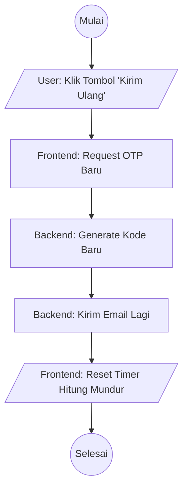

### F. Reset Password
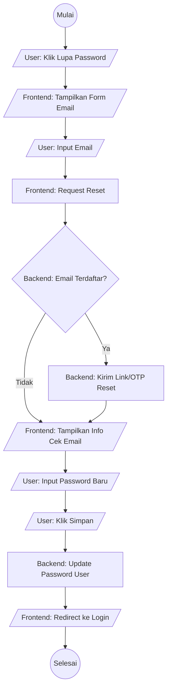

---

## 2. Profile Management
*(Sama seperti sebelumnya)*
### A. Update Profile (Nama, Foto, Bio)
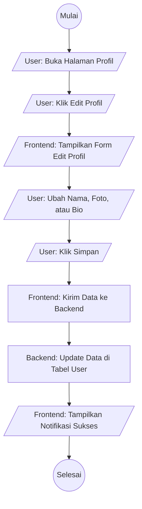

### B. Update Password (Ganti Kata Sandi)
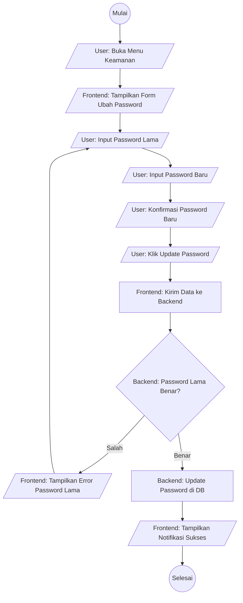

### C. Update Email
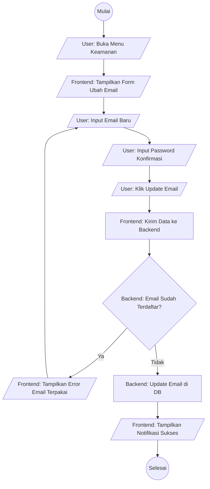

### D. Update Username
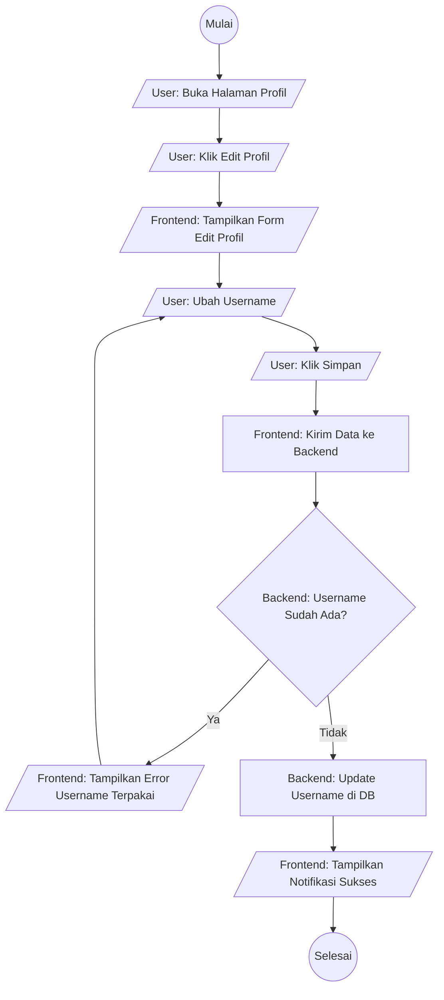

### E. Delete Account
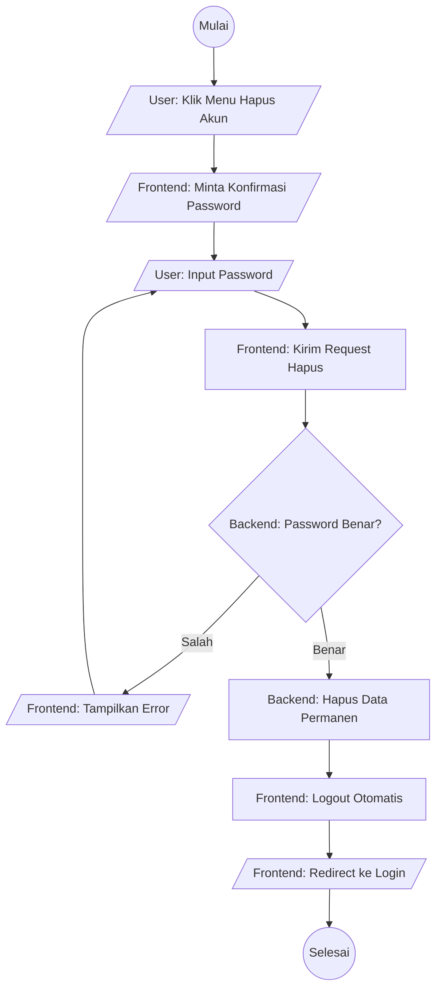

### F. Link Google Account
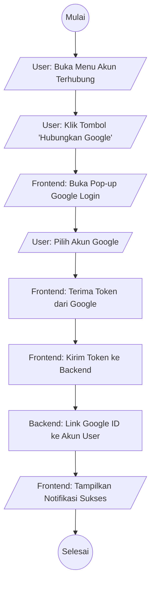

### G. Unlink Google Account
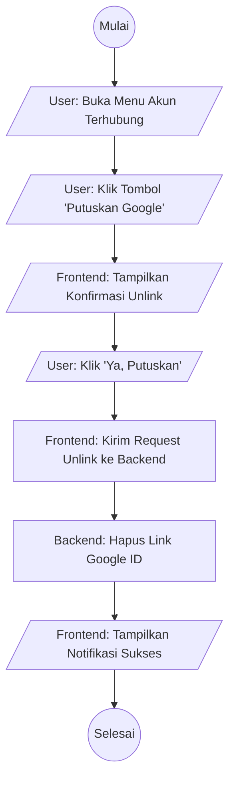

---

## 3. Address Management
*(Sama seperti sebelumnya)*
### A. View Address (Lihat Daftar Alamat)
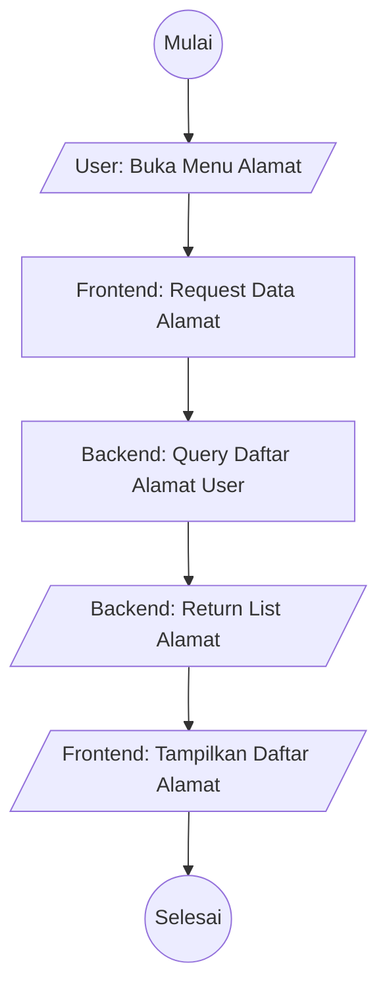

### B. Insert Address (Tambah Alamat)
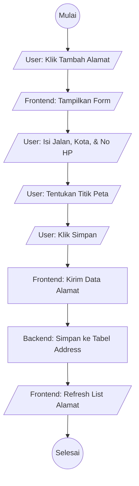

### C. Update Address (Ubah Alamat)
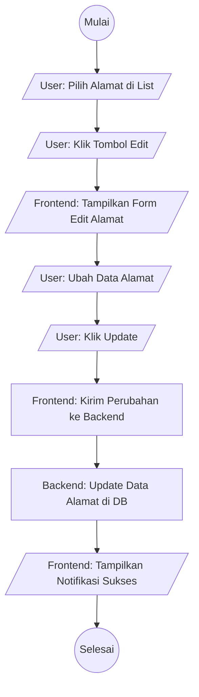

### D. Set Default Address (Set Utama)
```mermaid
flowchart TD
    Start((Mulai)) --> In1[/User: Pilih Alamat di List/]
    In1 --> In2[/User: Klik 'Jadikan Utama'/]
    In2 --> Proc1[Frontend: Request Set Default]
    Proc1 --> ProcDB[Backend: Update Status Default di DB]
    ProcDB --> OutRefresh[/Frontend: Urutkan Alamat (Utama di Atas)/]
    OutRefresh --> End((Selesai))
```

### E. Delete Address (Hapus Alamat)
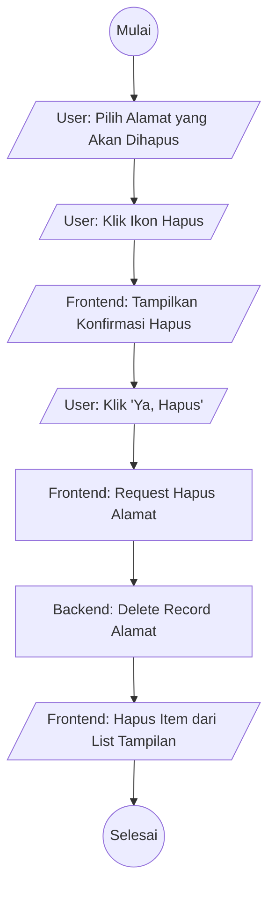

---

## 4. Cart & Order
*(Sama seperti sebelumnya)*
### A. View Cart (Lihat Keranjang)
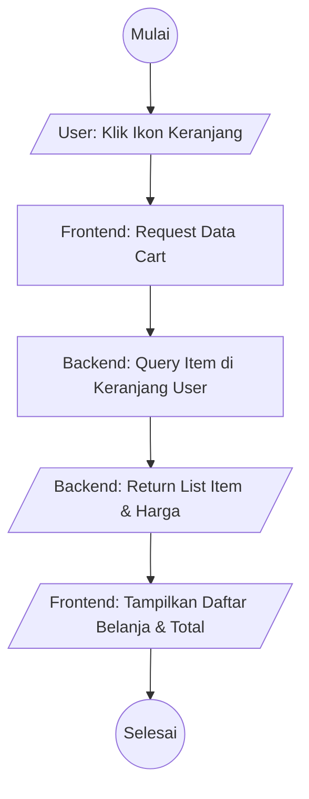

### B. Add Item to Cart (Tambah Barang)
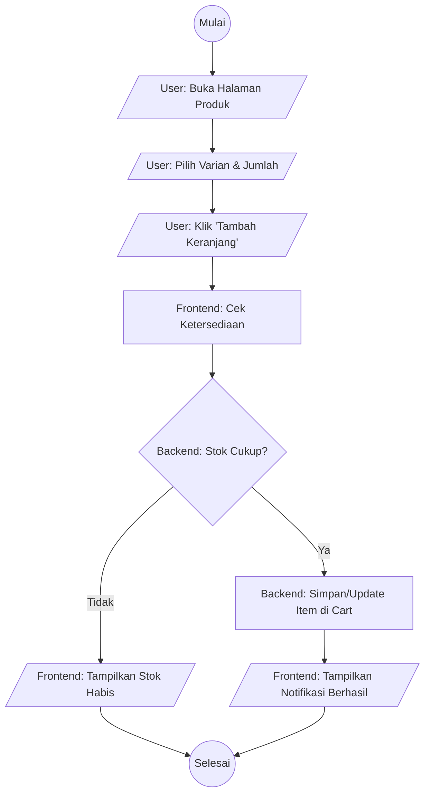

### C. Update Item Quantity (Ubah Jumlah)
```mermaid
flowchart TD
    Start((Mulai)) --> In1[/User: Klik Tombol (+) atau (-)/]
    In1 --> Proc1[Frontend: Hitung Jumlah Baru/]
    Proc1 --> Proc2[Frontend: Request Update Qty ke Backend]
    Proc2 --> ProcDB[Backend: Update Quantity di DB]
    ProcDB --> OutCalc[/Frontend: Hitung Ulang Total Harga/]
    OutCalc --> End((Selesai))
```

### D. Remove Item from Cart (Hapus Barang)
```mermaid
flowchart TD
    Start((Mulai)) --> In1[/User: Geser Item / Klik Hapus/]
    In1 --> Out1[/Frontend: Tampilkan Konfirmasi Hapus/]
    Out1 --> In2[/User: Klik 'Ya'/]
    In2 --> Proc1[Frontend: Request Hapus Item]
    Proc1 --> ProcDB[Backend: Delete Item dari Cart]
    ProcDB --> OutRefresh[/Frontend: Hapus Item dari List Tampilan/]
    OutRefresh --> End((Selesai))
```

### E. Checkout Cart
```mermaid
flowchart TD
    Start((Mulai)) --> In1[/User: Klik Tombol Checkout/]
    In1 --> Out1[/Frontend: Tampilkan Halaman Checkout/]
    Out1 --> In2[/User: Pilih Alamat Pengiriman/]
    In2 --> In3[/User: Pilih Jasa Pengiriman/]
    In3 --> In4[/User: Pilih Metode Pembayaran/]
    In4 --> In5[/User: Klik 'Buat Pesanan'/]
    In5 --> Proc1[Frontend: Request Create Order]
    Proc1 --> ProcDB[Backend: Simpan Order (Status: Pending)]
    ProcDB --> OutPay[/Frontend: Arahkan ke Order Payment/]
    OutPay --> End((Selesai))
```

### F. Order Payment (Bayar Pesanan)
```mermaid
flowchart TD
    Start((Mulai)) --> In1[/User: Lihat Halaman Pembayaran/]
    In1 --> In2[/User: Transfer / Bayar via E-Wallet/]
    In2 --> Proc1[Frontend/Gateway: Verifikasi Pembayaran/]
    Proc1 --> Dec1{Backend: Pembayaran Sukses?}
    Dec1 -- Gagal --> OutFail[/Frontend: Tampilkan Pesan Gagal/]
    OutFail --> In1
    Dec1 -- Sukses --> ProcUpd[Backend: Update Status (Paid/Dikemas)]
    ProcUpd --> OutSucc[/Frontend: Tampilkan Struk & Status Sukses/]
    OutSucc --> End((Selesai))
```

### G. Track Order Status (Lacak Pesanan)
```mermaid
flowchart TD
    Start((Mulai)) --> In1[/User: Buka Riwayat Pesanan/]
    In1 --> In2[/User: Klik Salah Satu Pesanan/]
    In2 --> Proc1[Frontend: Request Detail & Tracking]
    Proc1 --> ProcDB[Backend: Ambil Status & Resi Pengiriman]
    ProcDB --> OutData[/Backend: Return Data Tracking/]
    OutData --> OutUI[/Frontend: Tampilkan Posisi Paket/]
    OutUI --> End((Selesai))
```

---

## 5. Health Records

### A. Health Profile (Profil Kesehatan: Tinggi/Berat/GolDar)

#### A1. Input Health Profile (Initial Setup)
*Dilakukan hanya sekali setelah Register.*
```mermaid
flowchart TD
    Start((Mulai)) --> In1[/User: Masuk Halaman Profil Awal/]
    In1 --> In2[/User: Pilih Pengalaman (Simple/Advanced)/]
    In2 --> In3[/User: Klik Lanjut/]
    In3 --> In4[/User: Isi Data PageView (Tinggi, Berat, dll)/]
    In4 --> Dec1{User: Sudah di Halaman Akhir?}
    Dec1 -- Belum --> In4
    Dec1 -- Ya --> In5[/User: Klik Simpan/]
    In5 --> Proc1[Frontend: Kumpulkan Semua Data]
    Proc1 --> ProcDB[Backend: Simpan Profil Kesehatan Baru]
    ProcDB --> ProcAuth[Frontend: Validasi Status & Masuk Home]
    ProcAuth --> End((Selesai))
```

#### A2. View Health Profile
```mermaid
flowchart TD
    Start((Mulai)) --> In1[/User: Buka Menu Profil Kesehatan/]
    In1 --> Proc1[Frontend: Request Data Profil]
    Proc1 --> ProcDB[Backend: Ambil Data Health Profile]
    ProcDB --> OutUI[/Frontend: Tampilkan Data, BMI, & Grafik/]
    OutUI --> End((Selesai))
```

#### A3. Update Health Profile (Edit)
*Dilakukan jika user ingin mengubah data setelah masuk aplikasi.*
```mermaid
flowchart TD
    Start((Mulai)) --> In1[/User: Buka Menu Profil Kesehatan/]
    In1 --> In2[/User: Klik Edit Profil/]
    In2 --> Out1[/Frontend: Tampilkan Form Edit dengan Data Lama/]
    Out1 --> In3[/User: Ubah Data (Berat/Tinggi/Obat)/]
    In3 --> In4[/User: Klik Simpan Perubahan/]
    In4 --> Proc1[Frontend: Hitung Ulang (misal BMI)/]
    Proc1 --> ProcDB[Backend: Update Record di Database]
    ProcDB --> OutSucc[/Frontend: Kembali ke Tampilan Profil & Notif Sukses/]
    OutSucc --> End((Selesai))
```

---

### B. HbA1c Record (Gula Darah Jangka Panjang)

#### B1. Input HbA1c
```mermaid
flowchart TD
    Start((Mulai)) --> In1[/User: Buka Input HbA1c/]
    In1 --> In2[/User: Input Nilai % & Tanggal Tes/]
    In2 --> In3[/User: Klik Simpan/]
    In3 --> Dec1{Frontend: Nilai dalam Range Valid?}
    
    Dec1 -- Tidak --> OutErr[/Frontend: Tampilkan Pesan Error Range/]
    OutErr --> In2
    
    Dec1 -- Ya --> ProcSave[Backend: Simpan Record HbA1c]
    ProcSave --> OutSucc[/Frontend: Notifikasi Sukses/]
    OutSucc --> End((Selesai))
```
#### B2. View HbA1c
```mermaid
flowchart TD
    Start((Mulai)) --> In1[/User: Buka Menu HbA1c/]
    In1 --> Proc1[Frontend: Request Riwayat]
    Proc1 --> ProcDB[Backend:   ]
    ProcDB --> OutUI[/Frontend: Tampilkan Grafik Tren HbA1c/]
    OutUI --> End((Selesai))
```
#### B3. Update HbA1c
```mermaid
flowchart TD
    Start((Mulai)) --> In1[/User: Pilih Item HbA1c/]
    In1 --> In2[/User: Ubah Nilai/Tanggal/]
    In2 --> In3[/User: Klik Update/]
    In3 --> ProcDB[Backend: Update Record HbA1c]
    ProcDB --> OutSucc[/Frontend: Notifikasi Sukses/]
    OutSucc --> End((Selesai))
```
#### B4. Delete HbA1c
```mermaid
flowchart TD
    Start((Mulai)) --> In1[/User: Geser Item HbA1c/]
    In1 --> In2[/User: Klik Hapus/]
    In2 --> ProcDB[Backend: Hapus Record HbA1c]
    ProcDB --> OutSucc[/Frontend: Notifikasi Sukses/]
    OutSucc --> End((Selesai))
```

---

### C. Health Event (Kejadian Kesehatan: Pusing, Mual, dll)

#### C1. Input Health Event
```mermaid
flowchart TD
    Start((Mulai)) --> In1[/User: Klik Tambah Keluhan/]
    In1 --> In2[/User: Pilih Gejala & Intensitas/]
    In2 --> In3[/User: Klik Simpan/]
    In3 --> Dec1{Frontend: Input Valid?}
    Dec1 -- Tidak --> OutErr[/Frontend: Tampilkan Pesan Error/]
    OutErr --> In2
    Dec1 -- Ya --> ProcDB[Backend: Simpan Log Keluhan]
    ProcDB --> OutSucc[/Frontend: Notifikasi Sukses/]
    OutSucc --> End((Selesai))
```
#### C2. View Health Event
```mermaid
flowchart TD
    Start((Mulai)) --> In1[/User: Buka Log Keluhan/]
    In1 --> ProcDB[Backend: Ambil Data Keluhan]
    ProcDB --> OutUI[/Frontend: Tampilkan Daftar Gejala/]
    OutUI --> End((Selesai))
```
#### C3. Update Health Event
```mermaid
flowchart TD
    Start((Mulai)) --> In1[/User: Pilih Keluhan/]
    In1 --> In2[/User: Ubah Detail Gejala/]
    In2 --> In3[/User: Klik Update/]
    In3 --> ProcDB[Backend: Update Log Keluhan]
    ProcDB --> OutSucc[/Frontend: Notifikasi Sukses/]
    OutSucc --> End((Selesai))
```
#### C4. Delete Health Event
```mermaid
flowchart TD
    Start((Mulai)) --> In1[/User: Geser Keluhan/]
    In1 --> In2[/User: Klik Hapus/]
    In2 --> ProcDB[Backend: Hapus Log Keluhan]
    ProcDB --> OutSucc[/Frontend: Notifikasi Sukses/]
    OutSucc --> End((Selesai))
```

---

### D. Glucose Reading (Gula Darah Harian)

#### D1. Input Glucose
```mermaid
flowchart TD
    Start((Mulai)) --> In1[/User: Buka Input Glukosa/]
    In1 --> In2[/User: Input Angka, Waktu, & Kategori (Puasa/Makan)/]
    In2 --> In3[/User: Klik Simpan/]
    In3 --> Dec1{Frontend: Cek Nilai Normal/Bahaya?}
    Dec1 -- Bahaya --> OutAlert[/Frontend: Tampilkan Peringatan/]
    Dec1 -- Normal --> Proc1
    OutAlert --> Proc1[Frontend: Kirim Data]
    Proc1 --> ProcDB[Backend: Simpan Log Glukosa]
    ProcDB --> OutSucc[/Frontend: Notifikasi Sukses/]
    OutSucc --> End((Selesai))
```
#### D2. View Glucose
```mermaid
flowchart TD
    Start((Mulai)) --> In1[/User: Buka Grafik Glukosa/]
    In1 --> Proc1[Backend: Query Data & Analisa Tren]
    Proc1 --> OutUI[/Frontend: Tampilkan Grafik Harian/Mingguan/]
    OutUI --> End((Selesai))
```
#### D3. Update Glucose
```mermaid
flowchart TD
    Start((Mulai)) --> In1[/User: Pilih Data Glukosa/]
    In1 --> In2[/User: Ubah Angka/Waktu/]
    In2 --> In3[/User: Klik Update/]
    In3 --> ProcDB[Backend: Update Data Glukosa]
    ProcDB --> OutSucc[/Frontend: Notifikasi Sukses/]
    OutSucc --> End((Selesai))
```
#### D4. Delete Glucose
```mermaid
flowchart TD
    Start((Mulai)) --> In1[/User: Geser Data Glukosa/]
    In1 --> In2[/User: Klik Hapus/]
    In2 --> ProcDB[Backend: Hapus Data Glukosa]
    ProcDB --> OutSucc[/Frontend: Notifikasi Sukses/]
    OutSucc --> End((Selesai))
```

---

### E. Activity Logs (Olahraga/Aktivitas Fisik)

#### E1. View Activity Types (Pilih Jenis Aktivitas)
*Langkah awal sebelum melihat riwayat atau menambah log.*
```mermaid
flowchart TD
    Start((Mulai)) --> In1[/User: Buka Menu Aktivitas/]
    In1 --> Proc1[Frontend: Request Daftar Tipe Aktivitas/]
    Proc1 --> ProcDB[Backend: GetActivity Types/]
    ProcDB --> OutUI[/Frontend: Tampilkan Grid/List Jenis Aktivitas/]
    OutUI --> End((Selesai))
```

#### E2. Input Activity Log
```mermaid
flowchart TD
    Start((Mulai)) --> In0[/User: Pilih Jenis Aktivitas/]
    In0 --> In1[/User: Klik Tombol Tambah Log/]
    In1 --> In2[/User: Input Durasi & Intensitas/]
    In2 --> In3[/User: Klik Simpan/]
    In3 --> Dec1{Frontend: Input Valid?}
    Dec1 -- Tidak --> OutErr[/Frontend: Tampilkan Error/]
    OutErr --> In2
    Dec1 -- Ya --> Proc1[Frontend: Estimasi Kalori Terbakar]
    Proc1 --> ProcDB[Backend: Simpan Log Aktivitas]
    ProcDB --> OutSucc[/Frontend: Notifikasi Sukses/]
    OutSucc --> End((Selesai))
```

#### E3. View Activity History (Riwayat per Aktivitas)
```mermaid
flowchart TD
    Start((Mulai)) --> In1[/User: Pilih Jenis Aktivitas/]
    In1 --> ProcDB[Backend: Get Logs by Type/]
    ProcDB --> OutUI[/Frontend: Tampilkan Riwayat & Grafik Aktivitas Tersebut/]
    OutUI --> End((Selesai))
```

#### E4. Update Activity Log
```mermaid
flowchart TD
    Start((Mulai)) --> In1[/User: Pilih Item di Riwayat/]
    In1 --> In2[/User: Ubah Durasi/Intensitas/]
    In2 --> In3[/User: Klik Update/]
    In3 --> Proc1[Frontend: Hitung Ulang Kalori/]
    Proc1 --> ProcDB[Backend: Update Log Aktivitas]
    ProcDB --> OutSucc[/Frontend: Notifikasi Sukses/]
    OutSucc --> End((Selesai))
```

#### E5. Delete Activity Log
```mermaid
flowchart TD
    Start((Mulai)) --> In1[/User: Geser Aktivitas/]
    In1 --> In2[/User: Klik Hapus/]
    In2 --> ProcDB[Backend: Hapus Log Aktivitas]
    ProcDB --> OutSucc[/Frontend: Notifikasi Sukses/]
    OutSucc --> End((Selesai))
```

---

### F. Sleep Logs (Tidur)

#### F1. View Sleep Dashboard (Halaman Utama Tidur)
*Menampilkan ringkasan kualitas tidur dan grafik.*
```mermaid
flowchart TD
    Start((Mulai)) --> In1[/User: Buka Menu Tidur/]
    In1 --> ProcDB[Backend: Get Sleep Summary & History/]
    ProcDB --> OutUI[/Frontend: Tampilkan Grafik & List Tidur/]
    OutUI --> End((Selesai))
```

#### F2. Input Sleep Log
```mermaid
flowchart TD
    Start((Mulai)) --> In0[/User: Klik Tambah Data Tidur/]
    In0 --> In1[/User: Set Waktu Tidur & Bangun/]
    In1 --> In2[/User: Klik Simpan/]
    In2 --> Dec1{Frontend: Waktu Valid?}
    Dec1 -- Tidak --> OutErr[/Frontend: Tampilkan Error/]
    OutErr --> In1
    Dec1 -- Ya --> Proc1[Frontend: Hitung Durasi Tidur]
    Proc1 --> ProcDB[Backend: Simpan Log Tidur]
    ProcDB --> OutSucc[/Frontend: Notifikasi Sukses/]
    OutSucc --> End((Selesai))
```

#### F3. Update Sleep Log
```mermaid
flowchart TD
    Start((Mulai)) --> In1[/User: Pilih Data di List/]
    In1 --> In2[/User: Ubah Jam Tidur/Bangun/]
    In2 --> In3[/User: Klik Update/]
    In3 --> ProcDB[Backend: Update Log Tidur]
    ProcDB --> OutSucc[/Frontend: Notifikasi Sukses/]
    OutSucc --> End((Selesai))
```

#### F4. Delete Sleep Log
```mermaid
flowchart TD
    Start((Mulai)) --> In1[/User: Geser Data Tidur/]
    In1 --> In2[/User: Klik Hapus/]
    In2 --> ProcDB[Backend: Hapus Log Tidur]
    ProcDB --> OutSucc[/Frontend: Notifikasi Sukses/]
    OutSucc --> End((Selesai))
```

---

### G. Medication (Daftar Obat/Resep)

#### G1. Input Medication
```mermaid
flowchart TD
    Start((Mulai)) --> In1[/User: Tambah Obat Baru/]
    In1 --> In2[/User: Input Nama, Dosis, Stok, Bentuk/]
    In2 --> In3[/User: Klik Simpan/]
    In3 --> ProcDB[Backend: Simpan Data Obat/]
    ProcDB --> OutSucc[/Frontend: Notifikasi Sukses/]
    OutSucc --> End((Selesai))
```
#### G2. View Medication List
```mermaid
flowchart TD
    Start((Mulai)) --> In1[/User: Buka Daftar Obat/]
    In1 --> ProcDB[Backend: Get Medication List/]
    ProcDB --> OutUI[/Frontend: Tampilkan List Obat & Stok/]
    OutUI --> End((Selesai))
```
#### G3. Update Medication
```mermaid
flowchart TD
    Start((Mulai)) --> In1[/User: Pilih Obat/]
    In1 --> In2[/User: Edit Dosis/Jadwal/]
    In2 --> In3[/User: Klik Update/]
    In3 --> Proc1[Frontend: Update Alarm/]
    Proc1 --> ProcDB[Backend: Update Data Obat/]
    ProcDB --> OutSucc[/Frontend: Notifikasi Sukses/]
    OutSucc --> End((Selesai))
```
#### G4. Delete Medication
```mermaid
flowchart TD
    Start((Mulai)) --> In1[/User: Klik Hapus/]
    In1 --> ProcDB[Backend: Hapus Obat/]
    ProcDB --> OutSucc[/Frontend: Notifikasi Sukses/]
    OutSucc --> End((Selesai))
```

---

### H. Medication Logs (Histori Minum Obat)

#### H1. Input Medication Log (Minum)
```mermaid
flowchart TD
    Start((Mulai)) --> In1[/User: Buka Menu Log Obat/]
    In1 --> In2[/User: Pilih Obat dari Daftar/]
    In2 --> In3[/User: Input Waktu Minum, Dosis, dll./]
    In3 --> In4[/User: Konfirmasi Data Log/]
    In4 --> In5[/User: Klik Simpan/]
    In5 --> ProcDB[Backend: Simpan Log Minum & Kurangi Stok/]
    ProcDB --> OutSucc[/Frontend: Notifikasi Sukses/]
    OutSucc --> End((Selesai))
```
#### H2. View Medication Log
```mermaid
flowchart TD
    Start((Mulai)) --> In1[/User: Buka Histori Obat/]
    In1 --> ProcDB[Backend: Get Logs/]
    ProcDB --> OutUI[/Frontend: Tampilkan Riwayat Kepatuhan/]
    OutUI --> End((Selesai))
```
#### H3. Update Medication Log (Jarang, misal salah klik)
```mermaid
flowchart TD
    Start((Mulai)) --> In1[/User: Pilih Log 'Sudah Diminum'/]
    In1 --> In2[/User: Ubah Jam/Batalkan/]
    In2 --> In3[/User: Klik Update/]
    In3 --> ProcDB[Backend: Update Log & Koreksi Stok/]
    ProcDB --> OutSucc[/Frontend: Notifikasi Sukses/]
    OutSucc --> End((Selesai))
```
#### H4. Delete Medication Log
```mermaid
flowchart TD
    Start((Mulai)) --> In1[/User: Geser Log/]
    In1 --> In2[/User: Klik Hapus/]
    In2 --> ProcDB[Backend: Delete Log/]
    ProcDB --> OutSucc[/Frontend: Notifikasi Sukses/]
    OutSucc --> End((Selesai))
```

---

### I. Meal Logs (Makanan)

#### I1. Input Meal
```mermaid
flowchart TD
    Start((Mulai)) --> InChoice{User: Pilih Metode?}
    
    %% Flow Pencarian Database
    InChoice -- Cari Database --> InSearch[/User: Ketik Nama Makanan/]
    InSearch --> ProcSearch[Backend: Cari di DB]
    ProcSearch --> OutList[/Frontend: Tampilkan Hasil/]
    OutList --> InSelect[/User: Pilih Makanan & Porsi/]
    InSelect --> ProcCalc[Frontend: Hitung Nutrisi Otomatis]
    ProcCalc --> InSave
    
    %% Flow Input Manual
    InChoice -- Manual --> InManual[/User: Input Nama, Kalori, Karbo Mandiri/]
    InManual --> InSave
    
    %% Simpan
    InSave[/User: Klik Simpan/] --> ProcSave[Backend: Simpan Log Makan]
    ProcSave --> OutSucc[/Frontend: Notifikasi Sukses/]
    OutSucc --> End((Selesai))
```
#### I2. View Meal
```mermaid
flowchart TD
    Start((Mulai)) --> In1[/User: Buka Diary Makanan/]
    In1 --> ProcDB[Backend: Get Meal Logs/]
    ProcDB --> OutUI[/Frontend: Tampilkan List Makanan & Total Kalori Harian/]
    OutUI --> End((Selesai))
```
#### I3. Update Meal
```mermaid
flowchart TD
    Start((Mulai)) --> In1[/User: Pilih Makanan di Diary/]
    In1 --> In2[/User: Ubah Porsi/]
    In2 --> In3[/User: Klik Update/]
    In3 --> Proc1[Frontend: Hitung Ulang Nutrisi/]
    Proc1 --> ProcDB[Backend: Update Log Makan/]
    ProcDB --> OutSucc[/Frontend: Notifikasi Sukses/]
    OutSucc --> End((Selesai))
```
#### I4. Delete Meal
```mermaid
flowchart TD
    Start((Mulai)) --> In1[/User: Geser Makanan/]
    In1 --> In2[/User: Klik Hapus/]
    In2 --> ProcDB[Backend: Hapus Log Makan/]
    ProcDB --> OutSucc[/Frontend: Notifikasi Sukses/]
    OutSucc --> End((Selesai))
```

---

## 6. AI Features

### A. Recommendation System

#### A1. Insert Recommendation Preferences
*User memilih preferensi dan mengirim data untuk diproses AI.*
```mermaid
flowchart TD
    Start((Mulai)) --> In1[/User: Buka Tab Rekomendasi/]
    In1 --> InChoice{User: Pilih Kategori Rekomendasi?}
    
    %% Flow Makanan
    InChoice -- Makanan --> InPrefFood[/User: Pilih Preferensi Makanan/]
    InPrefFood --> InQFood[/User: Input Pertanyaan Makanan (Opsional)/]
    InQFood --> InSend
    
    %% Flow Aktivitas
    InChoice -- Aktivitas --> InPrefAct[/User: Pilih Preferensi Aktivitas/]
    InPrefAct --> InQAct[/User: Input Pertanyaan Aktivitas (Opsional)/]
    InQAct --> InSend
    
    %% Flow Insight
    InChoice -- Insight --> InQInsight[/User: Input Pertanyaan Medis/]
    InQInsight --> InSend
    
    %% Merge Send
    InSend[/User: Klik Kirim/] --> Proc1[Frontend: Kirim Data ke Backend]
    Proc1 --> ProcDB[Backend: Proses Request AI]
    ProcDB --> DecStatus{Backend: Berhasil?}
    DecStatus -- Gagal --> OutErr[/Frontend: Tampilkan Pesan Error/]
    OutErr --> InSend
    DecStatus -- Sukses --> OutUI[/Frontend: Tampilkan Hasil Rekomendasi/]
    OutUI --> End((Selesai))
```

#### A2. Get Last Recommendation
*User melihat hasil rekomendasi terakhir yang digenerate AI.*
```mermaid
flowchart TD
    Start((Mulai)) --> In1[/User: Buka Halaman Hasil/]
    In1 --> Proc1[Frontend: Request Rekomendasi Terakhir/]
    Proc1 --> ProcDB[Backend: Ambil Data Respon AI Terakhir/]
    ProcDB --> OutUI[/Frontend: Tampilkan Hasil Rekomendasi/]
    OutUI --> End((Selesai))
```

### B. Feedback AI Recommendations

#### B1. Food Recommendation Feedback
*User memberikan umpan balik khusus untuk rekomendasi makanan.*
```mermaid
flowchart TD
    Start((Mulai)) --> In1[/User: Klik Feedback pada Rekomendasi Makanan/]
    In1 --> In2[/User: Input Rating & Komentar/]
    In2 --> In3[/User: Klik Kirim/]
    In3 --> Proc1[Frontend: Kirim Data ke Backend]
    Proc1 --> ProcDB[Backend: Simpan Feedback Makanan]
    ProcDB --> OutSucc[/Frontend: Notifikasi Sukses/]
    OutSucc --> End((Selesai))
```

#### B2. Activity Recommendation Feedback
*User memberikan umpan balik khusus untuk rekomendasi aktivitas.*
```mermaid
flowchart TD
    Start((Mulai)) --> In1[/User: Klik Feedback pada Rekomendasi Aktivitas/]
    In1 --> In2[/User: Input Rating & Komentar/]
    In2 --> In3[/User: Klik Kirim/]
    In3 --> Proc1[Frontend: Kirim Data ke Backend]
    Proc1 --> ProcDB[Backend: Simpan Feedback Aktivitas]
    ProcDB --> OutSucc[/Frontend: Notifikasi Sukses/]
    OutSucc --> End((Selesai))
```

#### B3. Overall Insight Feedback
*User memberikan penilaian terhadap kualitas insight AI secara umum.*
```mermaid
flowchart TD
    Start((Mulai)) --> In1[/User: Klik Feedback pada Insight/]
    In1 --> In2[/User: Input Rating & Komentar/]
    In2 --> In3[/User: Klik Kirim/]
    In3 --> Proc1[Frontend: Kirim Data ke Backend]
    Proc1 --> ProcDB[Backend: Simpan Feedback Insight]
    ProcDB --> OutSucc[/Frontend: Notifikasi Sukses/]
    OutSucc --> End((Selesai))
```