# Activity Diagram Glupulse

Dokumen ini berisi 77 Activity Diagram terpisah untuk setiap fitur yang tersedia di sistem Glupulse.

---

## 1. Sign Up
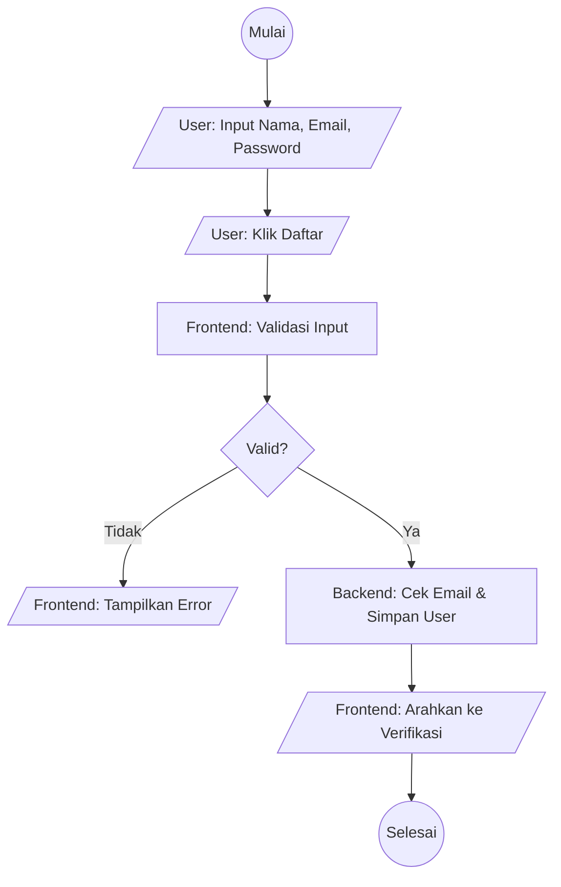
```mermaid
flowchart TD
    Start((Mulai)) --> In1[/User: Input Nama, Email, Password/]
    In1 --> In2[/User: Klik Daftar/]
    In2 --> Proc1[Frontend: Validasi Input]
    Proc1 --> Dec1{Valid?}
    Dec1 -- Tidak --> OutErr[/Frontend: Tampilkan Error/]
    Dec1 -- Ya --> Proc2[Backend: Cek Email & Simpan User]
    Proc2 --> OutSucc[/Frontend: Arahkan ke Verifikasi/]
    OutSucc --> End((Selesai))
```

## 2. Login
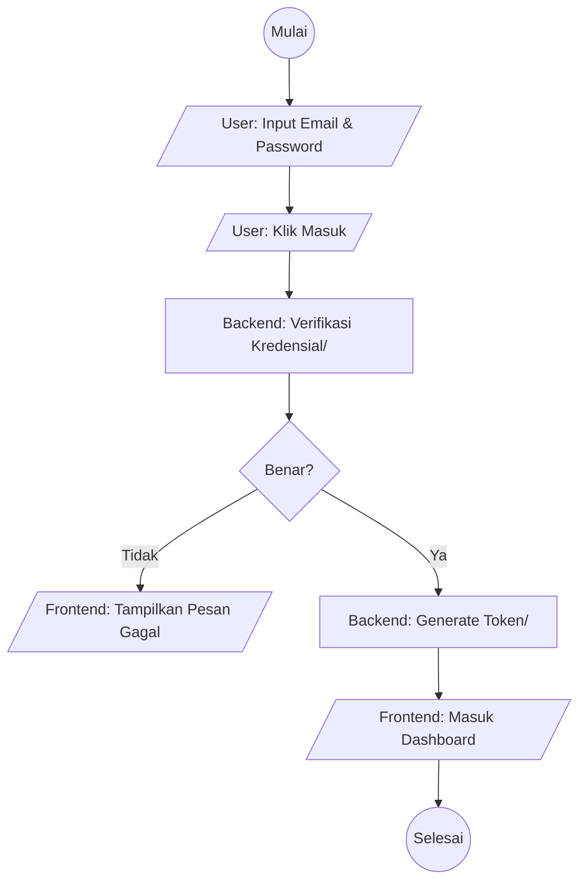
```mermaid
flowchart TD
    Start((Mulai)) --> In1[/User: Input Email & Password/]
    In1 --> In2[/User: Klik Masuk/]
    In2 --> Proc1[Backend: Verifikasi Kredensial/]
    Proc1 --> Dec1{Benar?}
    Dec1 -- Tidak --> OutErr[/Frontend: Tampilkan Pesan Gagal/]
    Dec1 -- Ya --> Proc2[Backend: Generate Token/]
    Proc2 --> OutHome[/Frontend: Masuk Dashboard/]
    OutHome --> End((Selesai))
```

## 3. Login with Google
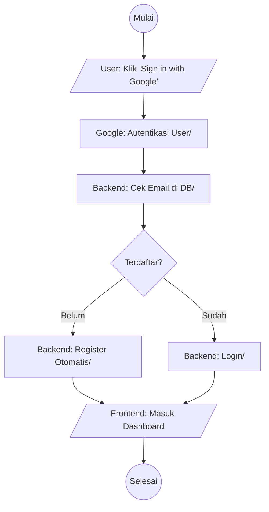
```mermaid
flowchart TD
    Start((Mulai)) --> In1[/User: Klik 'Sign in with Google'/]
    In1 --> Proc1[Google: Autentikasi User/]
    Proc1 --> Proc2[Backend: Cek Email di DB/]
    Proc2 --> Dec1{Terdaftar?}
    Dec1 -- Belum --> ProcReg[Backend: Register Otomatis/]
    Dec1 -- Sudah --> ProcLog[Backend: Login/]
    ProcReg --> OutHome[/Frontend: Masuk Dashboard/]
    ProcLog --> OutHome
    OutHome --> End((Selesai))
```

## 4. Input OTP
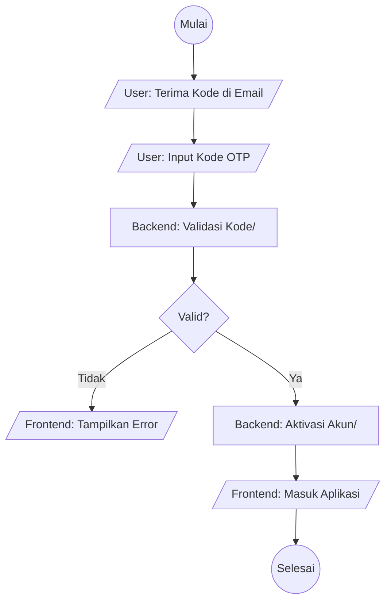
```mermaid
flowchart TD
    Start((Mulai)) --> In1[/User: Terima Kode di Email/]
    In1 --> In2[/User: Input Kode OTP/]
    In2 --> Proc1[Backend: Validasi Kode/]
    Proc1 --> Dec1{Valid?}
    Dec1 -- Tidak --> OutErr[/Frontend: Tampilkan Error/]
    Dec1 -- Ya --> Proc2[Backend: Aktivasi Akun/]
    Proc2 --> OutSucc[/Frontend: Masuk Aplikasi/]
    OutSucc --> End((Selesai))
```

## 5. Resend OTP
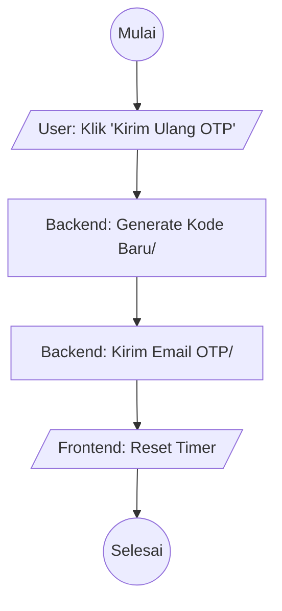
```mermaid
flowchart TD
    Start((Mulai)) --> In1[/User: Klik 'Kirim Ulang OTP'/]
    In1 --> Proc1[Backend: Generate Kode Baru/]
    Proc1 --> Proc2[Backend: Kirim Email OTP/]
    Proc2 --> OutSucc[/Frontend: Reset Timer/]
    OutSucc --> End((Selesai))
```

## 6. Request Password Reset
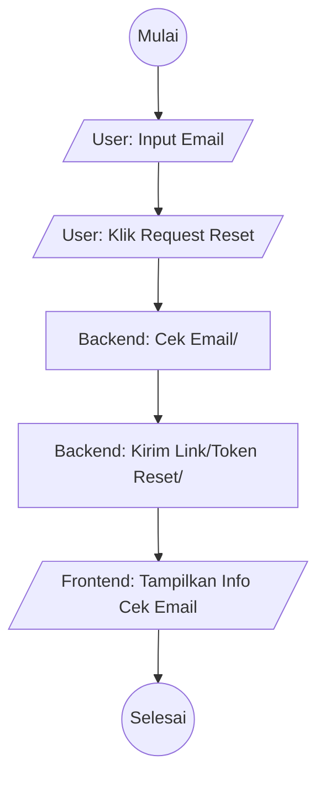
```mermaid
flowchart TD
    Start((Mulai)) --> In1[/User: Input Email/]
    In1 --> In2[/User: Klik Request Reset/]
    In2 --> Proc1[Backend: Cek Email/]
    Proc1 --> Proc2[Backend: Kirim Link/Token Reset/]
    Proc2 --> OutInfo[/Frontend: Tampilkan Info Cek Email/]
    OutInfo --> End((Selesai))
```

## 7. Reset Password
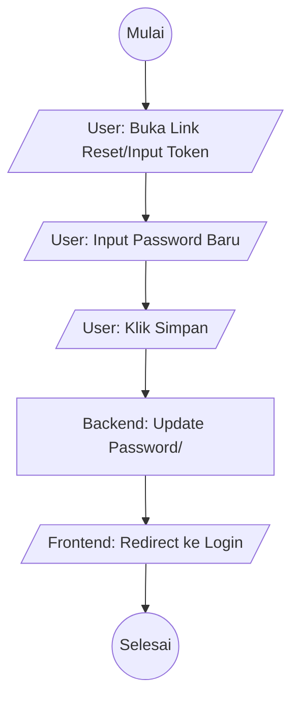
```mermaid
flowchart TD
    Start((Mulai)) --> In1[/User: Buka Link Reset/Input Token/]
    In1 --> In2[/User: Input Password Baru/]
    In2 --> In3[/User: Klik Simpan/]
    In3 --> Proc1[Backend: Update Password/]
    Proc1 --> OutSucc[/Frontend: Redirect ke Login/]
    OutSucc --> End((Selesai))
```

## 8. Log Out
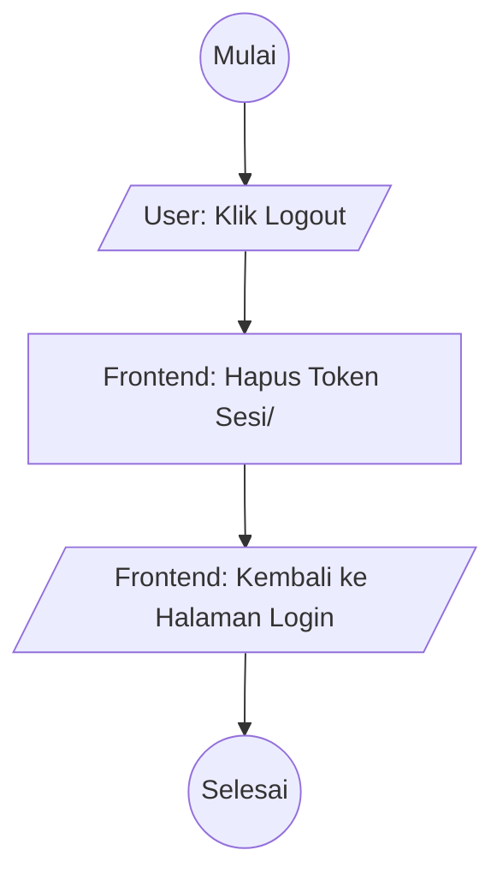
```mermaid
flowchart TD
    Start((Mulai)) --> In1[/User: Klik Logout/]
    In1 --> Proc1[Frontend: Hapus Token Sesi/]
    Proc1 --> OutLogin[/Frontend: Kembali ke Halaman Login/]
    OutLogin --> End((Selesai))
```

## 9. Update Profile
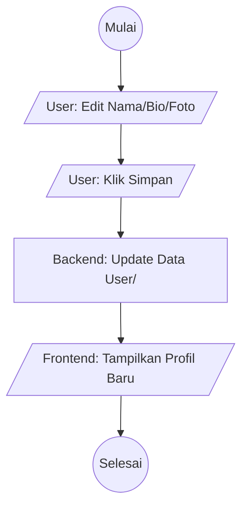
```mermaid
flowchart TD
    Start((Mulai)) --> In1[/User: Edit Nama/Bio/Foto/]
    In1 --> In2[/User: Klik Simpan/]
    In2 --> Proc1[Backend: Update Data User/]
    Proc1 --> OutSucc[/Frontend: Tampilkan Profil Baru/]
    OutSucc --> End((Selesai))
```

## 10. Update Password
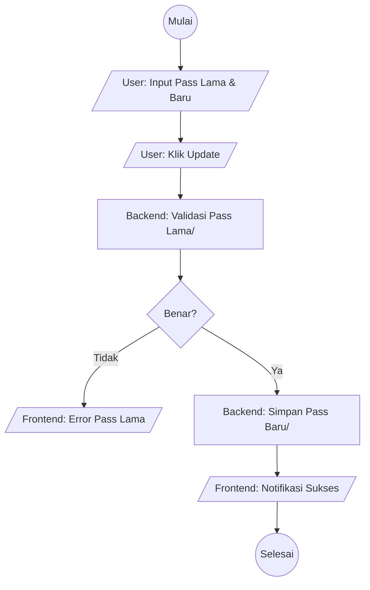
```mermaid
flowchart TD
    Start((Mulai)) --> In1[/User: Input Pass Lama & Baru/]
    In1 --> In2[/User: Klik Update/]
    In2 --> Proc1[Backend: Validasi Pass Lama/]
    Proc1 --> Dec1{Benar?}
    Dec1 -- Tidak --> OutErr[/Frontend: Error Pass Lama/]
    Dec1 -- Ya --> Proc2[Backend: Simpan Pass Baru/]
    Proc2 --> OutSucc[/Frontend: Notifikasi Sukses/]
    OutSucc --> End((Selesai))
```

## 11. Change Email
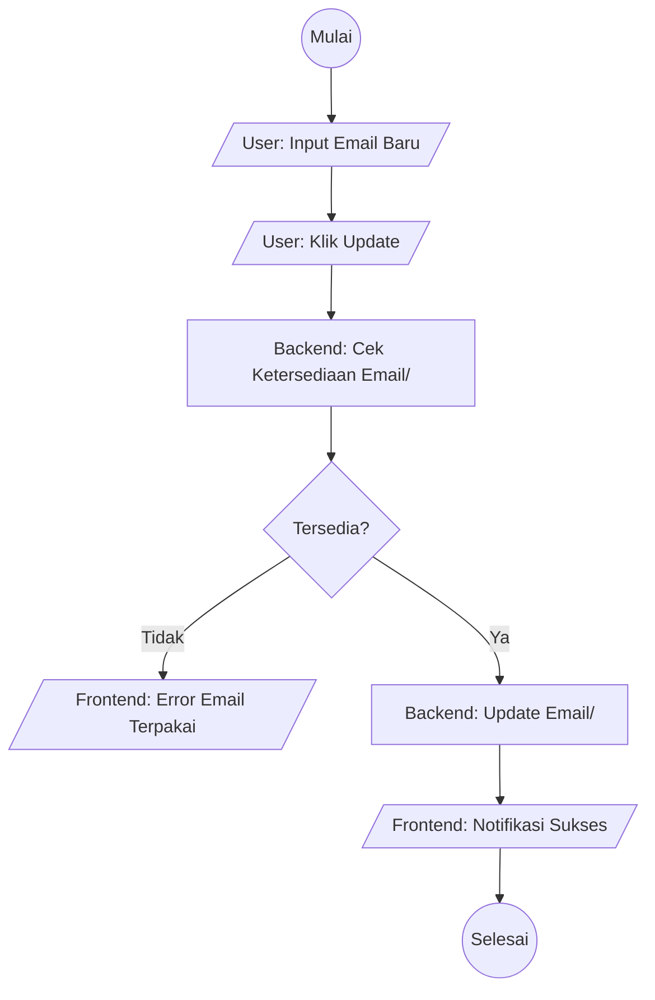
```mermaid
flowchart TD
    Start((Mulai)) --> In1[/User: Input Email Baru/]
    In1 --> In2[/User: Klik Update/]
    In2 --> Proc1[Backend: Cek Ketersediaan Email/]
    Proc1 --> Dec1{Tersedia?}
    Dec1 -- Tidak --> OutErr[/Frontend: Error Email Terpakai/]
    Dec1 -- Ya --> Proc2[Backend: Update Email/]
    Proc2 --> OutSucc[/Frontend: Notifikasi Sukses/]
    OutSucc --> End((Selesai))
```

## 12. Update Username
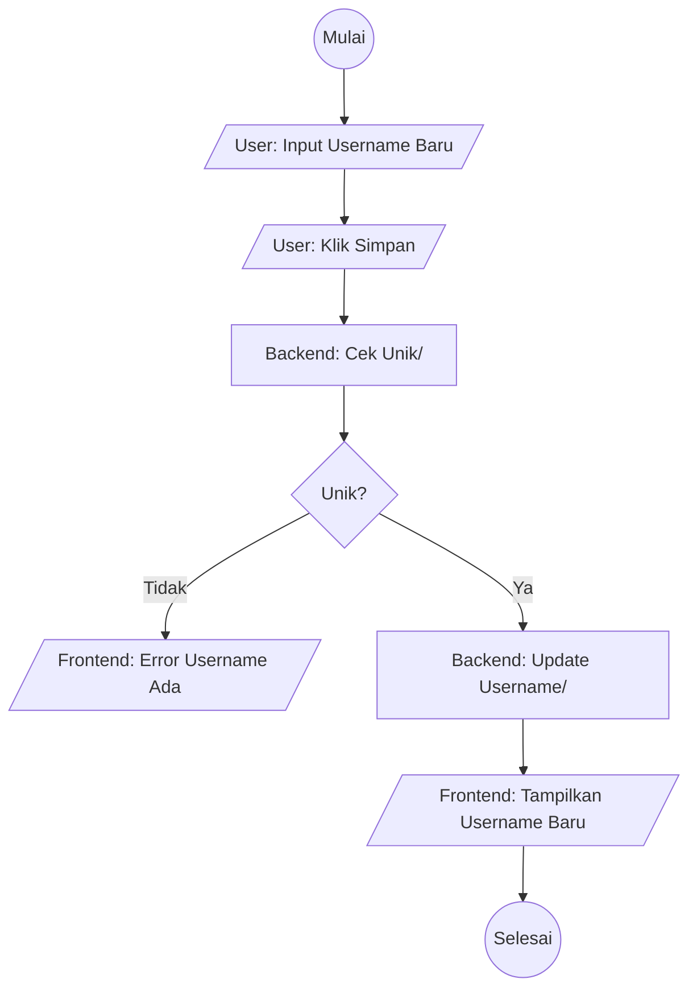
```mermaid
flowchart TD
    Start((Mulai)) --> In1[/User: Input Username Baru/]
    In1 --> In2[/User: Klik Simpan/]
    In2 --> Proc1[Backend: Cek Unik/]
    Proc1 --> Dec1{Unik?}
    Dec1 -- Tidak --> OutErr[/Frontend: Error Username Ada/]
    Dec1 -- Ya --> Proc2[Backend: Update Username/]
    Proc2 --> OutSucc[/Frontend: Tampilkan Username Baru/]
    OutSucc --> End((Selesai))
```

## 13. Link Google Account
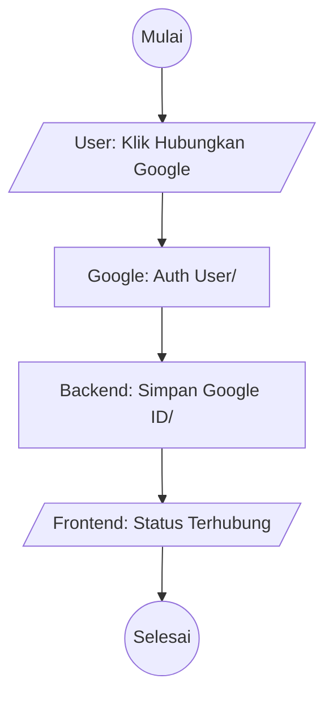
```mermaid
flowchart TD
    Start((Mulai)) --> In1[/User: Klik Hubungkan Google/]
    In1 --> Proc1[Google: Auth User/]
    Proc1 --> Proc2[Backend: Simpan Google ID/]
    Proc2 --> OutSucc[/Frontend: Status Terhubung/]
    OutSucc --> End((Selesai))
```

## 14. Unlink Google Account
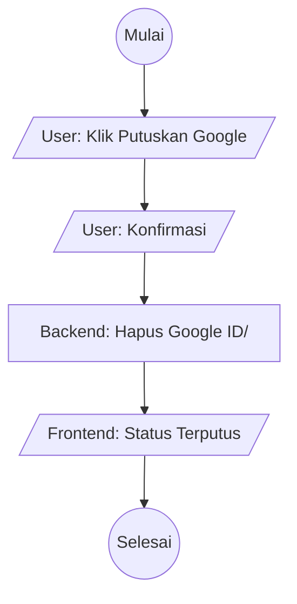
```mermaid
flowchart TD
    Start((Mulai)) --> In1[/User: Klik Putuskan Google/]
    In1 --> In2[/User: Konfirmasi/]
    In2 --> Proc1[Backend: Hapus Google ID/]
    Proc1 --> OutSucc[/Frontend: Status Terputus/]
    OutSucc --> End((Selesai))
```

## 15. Delete Account
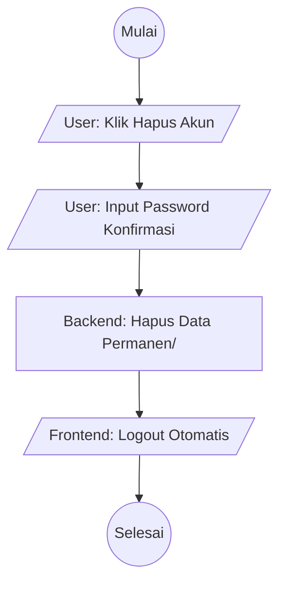
```mermaid
flowchart TD
    Start((Mulai)) --> In1[/User: Klik Hapus Akun/]
    In1 --> In2[/User: Input Password Konfirmasi/]
    In2 --> Proc1[Backend: Hapus Data Permanen/]
    Proc1 --> OutLog[/Frontend: Logout Otomatis/]
    OutLog --> End((Selesai))
```

## 16. Add Delivery Address
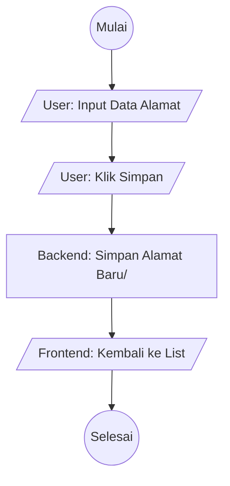
```mermaid
flowchart TD
    Start((Mulai)) --> In1[/User: Input Data Alamat/]
    In1 --> In2[/User: Klik Simpan/]
    In2 --> Proc1[Backend: Simpan Alamat Baru/]
    Proc1 --> OutSucc[/Frontend: Kembali ke List/]
    OutSucc --> End((Selesai))
```

## 17. View Address List
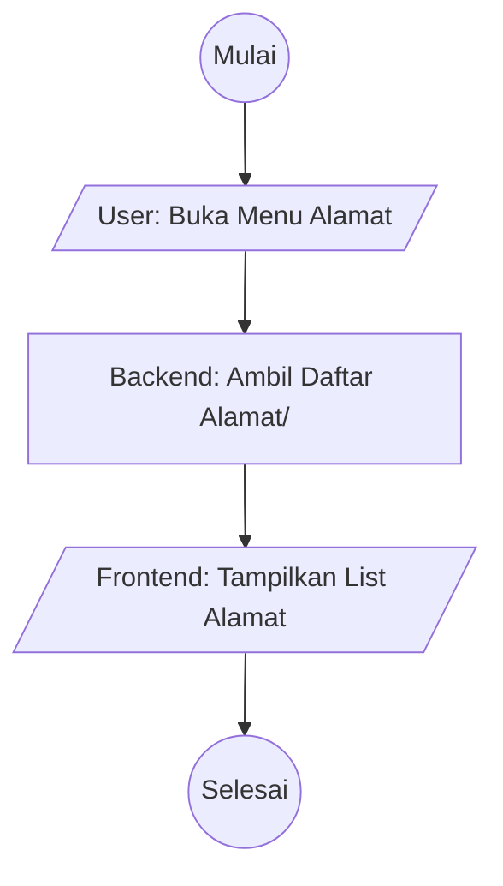
```mermaid
flowchart TD
    Start((Mulai)) --> In1[/User: Buka Menu Alamat/]
    In1 --> Proc1[Backend: Ambil Daftar Alamat/]
    Proc1 --> OutList[/Frontend: Tampilkan List Alamat/]
    OutList --> End((Selesai))
```

## 18. Update Address
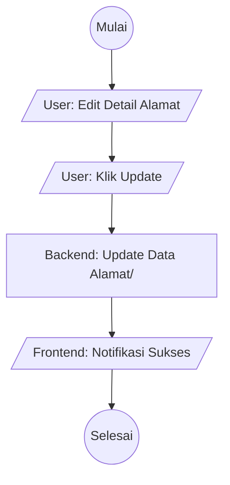
```mermaid
flowchart TD
    Start((Mulai)) --> In1[/User: Edit Detail Alamat/]
    In1 --> In2[/User: Klik Update/]
    In2 --> Proc1[Backend: Update Data Alamat/]
    Proc1 --> OutSucc[/Frontend: Notifikasi Sukses/]
    OutSucc --> End((Selesai))
```

## 19. Delete Address
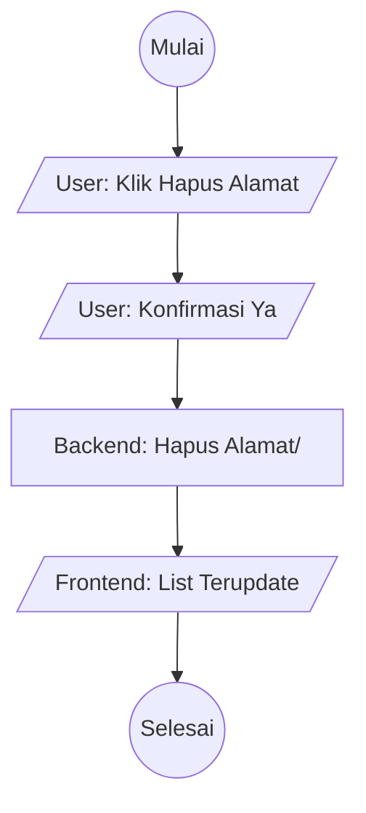
```mermaid
flowchart TD
    Start((Mulai)) --> In1[/User: Klik Hapus Alamat/]
    In1 --> In2[/User: Konfirmasi Ya/]
    In2 --> Proc1[Backend: Hapus Alamat/]
    Proc1 --> OutSucc[/Frontend: List Terupdate/]
    OutSucc --> End((Selesai))
```

## 20. Set Default Address
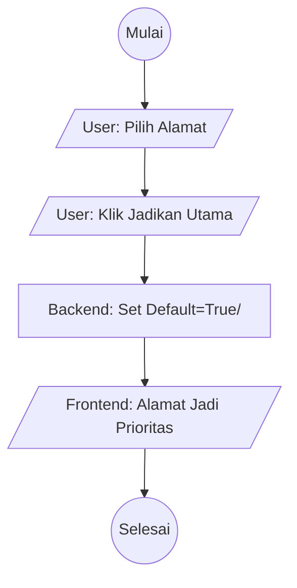
```mermaid
flowchart TD
    Start((Mulai)) --> In1[/User: Pilih Alamat/]
    In1 --> In2[/User: Klik Jadikan Utama/]
    In2 --> Proc1[Backend: Set Default=True/]
    Proc1 --> OutSucc[/Frontend: Alamat Jadi Prioritas/]
    OutSucc --> End((Selesai))
```

## 21. View Shopping Cart Item
```mermaid
flowchart TD
    Start((Mulai)) --> In1[/User: Buka Keranjang/]
    In1 --> Proc1[Backend: Ambil Item Keranjang/]
    Proc1 --> OutList[/Frontend: Tampilkan Produk & Total/]
    OutList --> End((Selesai))
```

## 22. Add Item to Cart
```mermaid
flowchart TD
    Start((Mulai)) --> In1[/User: Klik Tambah ke Keranjang/]
    In1 --> Proc1[Backend: Cek Stok/]
    Proc1 --> Dec1{Ada?}
    Dec1 -- Tidak --> OutErr[/Frontend: Info Stok Habis/]
    Dec1 -- Ya --> Proc2[Backend: Tambah Item/]
    Proc2 --> OutSucc[/Frontend: Notifikasi Sukses/]
    OutSucc --> End((Selesai))
```

## 23. Update Item Quantity in Cart
```mermaid
flowchart TD
    Start((Mulai)) --> In1[/User: Ubah Jumlah Item/]
    In1 --> Proc1[Backend: Update Qty/]
    Proc1 --> OutCalc[/Frontend: Hitung Ulang Total/]
    OutCalc --> End((Selesai))
```

## 24. Remove Item from Cart
```mermaid
flowchart TD
    Start((Mulai)) --> In1[/User: Klik Hapus Item/]
    In1 --> Proc1[Backend: Hapus dari Keranjang/]
    Proc1 --> OutSucc[/Frontend: Item Hilang/]
    OutSucc --> End((Selesai))
```

## 25. Checkout
```mermaid
flowchart TD
    Start((Mulai)) --> In1[/User: Klik Checkout/]
    In1 --> In2[/User: Pilih Opsi Pengiriman/]
    In2 --> Proc1[Backend: Buat Pesanan Pending/]
    Proc1 --> OutPay[/Frontend: Ke Halaman Bayar/]
    OutPay --> End((Selesai))
```

## 26. Simulate Payment
```mermaid
flowchart TD
    Start((Mulai)) --> In1[/User: Klik Bayar/]
    In1 --> Proc1[Backend: Proses Simulasi Bayar/]
    Proc1 --> Dec1{Sukses?}
    Dec1 -- Gagal --> OutErr[/Frontend: Pesan Gagal/]
    Dec1 -- Sukses --> Proc2[Backend: Update Status Paid/]
    Proc2 --> OutSucc[/Frontend: Tampilkan Sukses/]
    OutSucc --> End((Selesai))
```

## 27. Get Order History
```mermaid
flowchart TD
    Start((Mulai)) --> In1[/User: Buka Riwayat Pesanan/]
    In1 --> Proc1[Backend: Ambil List Order/]
    Proc1 --> OutList[/Frontend: Tampilkan Riwayat/]
    OutList --> End((Selesai))
```

## 28. Track Active Orders
```mermaid
flowchart TD
    Start((Mulai)) --> In1[/User: Klik Lacak Pesanan/]
    In1 --> Proc1[Backend: Ambil Status Terkini/]
    Proc1 --> OutStat[/Frontend: Tampilkan Posisi/]
    OutStat --> End((Selesai))
```

## 29. Rate Seller
```mermaid
flowchart TD
    Start((Mulai)) --> In1[/User: Beri Bintang & Ulasan/]
    In1 --> In2[/User: Klik Kirim/]
    In2 --> Proc1[Backend: Simpan Review/]
    Proc1 --> OutSucc[/Frontend: Terima Kasih/]
    OutSucc --> End((Selesai))
```

## 30. Upsert Health Profile
```mermaid
flowchart TD
    Start((Mulai)) --> Dec1{Entry Point}
    Dec1 -- "Selesai Sign Up / Login" --> ProcCheck[Backend: Cek Kelengkapan Profil]
    ProcCheck --> Dec2{Profil Lengkap?}
    Dec2 -- Ya --> End((Selesai / Dashboard))
    Dec2 -- Tidak --> In1[/User: Input Data Fisik, Kondisi & Target/]
    
    Dec1 -- "Menu Edit Profil" --> In1
    
    In1 --> In2[/User: Klik Simpan/]
    In2 --> Proc1[Backend: Cek Eksistensi Data]
    Proc1 --> Dec3{Data Ada?}
    Dec3 -- Belum --> ProcInsert[Backend: Insert Data Baru]
    Dec3 -- Sudah --> ProcUpdate[Backend: Update Data Lama]
    
    ProcInsert --> OutSucc[/Frontend: Tampilkan Dashboard & BMI/]
    ProcUpdate --> OutSucc
    OutSucc --> End
```

## 31. View Health Profile
```mermaid
flowchart TD
    Start((Mulai)) --> In1[/User: Buka Profil Kesehatan/]
    In1 --> Proc1[Backend: Ambil Data Profil/]
    Proc1 --> OutView[/Frontend: Tampilkan Data/]
    OutView --> End((Selesai))
```

## 32. Add HbA1c Record
```mermaid
flowchart TD
    Start((Mulai)) --> In1[/User: Input Nilai HbA1c/]
    In1 --> In2[/User: Klik Tambah/]
    In2 --> Proc1[Backend: Simpan Record/]
    Proc1 --> OutSucc[/Frontend: Masuk ke List/]
    OutSucc --> End((Selesai))
```

## 33. View HbA1c List
```mermaid
flowchart TD
    Start((Mulai)) --> In1[/User: Buka Menu HbA1c/]
    In1 --> Proc1[Backend: Ambil Data HbA1c/]
    Proc1 --> OutList[/Frontend: Tampilkan Grafik/List/]
    OutList --> End((Selesai))
```

## 34. Update HbA1c Record
```mermaid
flowchart TD
    Start((Mulai)) --> In1[/User: Edit Nilai HbA1c/]
    In1 --> In2[/User: Klik Update/]
    In2 --> Proc1[Backend: Update Record/]
    Proc1 --> OutSucc[/Frontend: Data Berubah/]
    OutSucc --> End((Selesai))
```

## 35. Delete HbA1c Record
```mermaid
flowchart TD
    Start((Mulai)) --> In1[/User: Klik Hapus Record/]
    In1 --> Proc1[Backend: Hapus Data/]
    Proc1 --> OutSucc[/Frontend: List Terupdate/]
    OutSucc --> End((Selesai))
```

## 36. Add Health Event
```mermaid
flowchart TD
    Start((Mulai)) --> In1[/User: Input Gejala/Keluhan/]
    In1 --> In2[/User: Klik Simpan/]
    In2 --> Proc1[Backend: Simpan Event/]
    Proc1 --> OutSucc[/Frontend: Notifikasi Sukses/]
    OutSucc --> End((Selesai))
```

## 37. View Health Event List
```mermaid
flowchart TD
    Start((Mulai)) --> In1[/User: Buka Log Keluhan/]
    In1 --> Proc1[Backend: Ambil Daftar Event/]
    Proc1 --> OutList[/Frontend: Tampilkan List/]
    OutList --> End((Selesai))
```

## 38. Update Health Event
```mermaid
flowchart TD
    Start((Mulai)) --> In1[/User: Edit Deskripsi Event/]
    In1 --> In2[/User: Klik Update/]
    In2 --> Proc1[Backend: Update Event/]
    Proc1 --> OutSucc[/Frontend: Data Berubah/]
    OutSucc --> End((Selesai))
```

## 39. Delete Health Event
```mermaid
flowchart TD
    Start((Mulai)) --> In1[/User: Klik Hapus Event/]
    In1 --> Proc1[Backend: Hapus Event/]
    Proc1 --> OutSucc[/Frontend: Event Hilang/]
    OutSucc --> End((Selesai))
```

## 40. Add Glucose Reading
```mermaid
flowchart TD
    Start((Mulai)) --> In1[/User: Input Angka Glukosa/]
    In1 --> In2[/User: Klik Simpan/]
    In2 --> Proc1[Backend: Simpan Bacaan/]
    Proc1 --> OutSucc[/Frontend: Update Grafik/]
    OutSucc --> End((Selesai))
```

## 41. View Glucose Reading List
```mermaid
flowchart TD
    Start((Mulai)) --> In1[/User: Buka Menu Glukosa/]
    In1 --> Proc1[Backend: Ambil Data Glukosa/]
    Proc1 --> OutView[/Frontend: Tampilkan Riwayat/]
    OutView --> End((Selesai))
```

## 42. Update Glucose Reading
```mermaid
flowchart TD
    Start((Mulai)) --> In1[/User: Edit Angka Glukosa/]
    In1 --> In2[/User: Klik Update/]
    In2 --> Proc1[Backend: Update Bacaan/]
    Proc1 --> OutSucc[/Frontend: Grafik Berubah/]
    OutSucc --> End((Selesai))
```

## 43. Delete Glucose Reading
```mermaid
flowchart TD
    Start((Mulai)) --> In1[/User: Klik Hapus Bacaan/]
    In1 --> Proc1[Backend: Hapus Data/]
    Proc1 --> OutSucc[/Frontend: List Terupdate/]
    OutSucc --> End((Selesai))
```

## 44. Add Activity Log
```mermaid
flowchart TD
    Start((Mulai)) --> In1[/User: Input Aktivitas & Durasi/]
    In1 --> In2[/User: Klik Simpan/]
    In2 --> Proc1[Backend: Simpan Log/]
    Proc1 --> OutSucc[/Frontend: Kalori Terhitung/]
    OutSucc --> End((Selesai))
```

## 45. View Activity Log List
```mermaid
flowchart TD
    Start((Mulai)) --> In1[/User: Buka Log Aktivitas/]
    In1 --> Proc1[Backend: Ambil Riwayat/]
    Proc1 --> OutList[/Frontend: Tampilkan List/]
    OutList --> End((Selesai))
```

## 46. Update Activity Log
```mermaid
flowchart TD
    Start((Mulai)) --> In1[/User: Edit Durasi Aktivitas/]
    In1 --> In2[/User: Klik Update/]
    In2 --> Proc1[Backend: Update Log/]
    Proc1 --> OutSucc[/Frontend: Data Berubah/]
    OutSucc --> End((Selesai))
```

## 47. Delete Activity Log
```mermaid
flowchart TD
    Start((Mulai)) --> In1[/User: Klik Hapus Log/]
    In1 --> Proc1[Backend: Hapus Log/]
    Proc1 --> OutSucc[/Frontend: Log Hilang/]
    OutSucc --> End((Selesai))
```

## 48. Add Sleep Log
```mermaid
flowchart TD
    Start((Mulai)) --> In1[/User: Input Jam Tidur & Bangun/]
    In1 --> In2[/User: Klik Simpan/]
    In2 --> Proc1[Backend: Simpan Log Tidur/]
    Proc1 --> OutSucc[/Frontend: Durasi Terhitung/]
    OutSucc --> End((Selesai))
```

## 49. View Sleep Log List
```mermaid
flowchart TD
    Start((Mulai)) --> In1[/User: Buka Log Tidur/]
    In1 --> Proc1[Backend: Ambil Riwayat/]
    Proc1 --> OutList[/Frontend: Tampilkan List/]
    OutList --> End((Selesai))
```

## 50. Update Sleep Log
```mermaid
flowchart TD
    Start((Mulai)) --> In1[/User: Edit Jam Tidur/]
    In1 --> In2[/User: Klik Update/]
    In2 --> Proc1[Backend: Update Log/]
    Proc1 --> OutSucc[/Frontend: Data Berubah/]
    OutSucc --> End((Selesai))
```

## 51. Delete Sleep Log
```mermaid
flowchart TD
    Start((Mulai)) --> In1[/User: Klik Hapus Log/]
    In1 --> Proc1[Backend: Hapus Log/]
    Proc1 --> OutSucc[/Frontend: Log Hilang/]
    OutSucc --> End((Selesai))
```

## 52. Add Medication
```mermaid
flowchart TD
    Start((Mulai)) --> In1[/User: Input Nama & Dosis Obat/]
    In1 --> In2[/User: Klik Tambah/]
    In2 --> Proc1[Backend: Simpan Obat Baru/]
    Proc1 --> OutSucc[/Frontend: Masuk Inventory/]
    OutSucc --> End((Selesai))
```

## 53. View Medication List
```mermaid
flowchart TD
    Start((Mulai)) --> In1[/User: Buka Daftar Obat/]
    In1 --> Proc1[Backend: Ambil Inventory/]
    Proc1 --> OutList[/Frontend: Tampilkan Obat/]
    OutList --> End((Selesai))
```

## 54. Update Medication
```mermaid
flowchart TD
    Start((Mulai)) --> In1[/User: Edit Detail Obat/]
    In1 --> In2[/User: Klik Update/]
    In2 --> Proc1[Backend: Update Obat/]
    Proc1 --> OutSucc[/Frontend: Info Berubah/]
    OutSucc --> End((Selesai))
```

## 55. Delete Medication
```mermaid
flowchart TD
    Start((Mulai)) --> In1[/User: Klik Hapus Obat/]
    In1 --> Proc1[Backend: Hapus Obat/]
    Proc1 --> OutSucc[/Frontend: Inventory Berkurang/]
    OutSucc --> End((Selesai))
```

## 56. Add Medication Intake Log
```mermaid
flowchart TD
    Start((Mulai)) --> In1[/User: Klik 'Sudah Minum'/]
    In1 --> Proc1[Backend: Simpan Log Minum/]
    Proc1 --> Proc2[Backend: Kurangi Stok/]
    Proc2 --> OutSucc[/Frontend: Status Tercentang/]
    OutSucc --> End((Selesai))
```

## 57. View Medication Intake Logs
```mermaid
flowchart TD
    Start((Mulai)) --> In1[/User: Buka Riwayat Minum/]
    In1 --> Proc1[Backend: Ambil Log Harian/]
    Proc1 --> OutList[/Frontend: Tampilkan Kepatuhan/]
    OutList --> End((Selesai))
```

## 58. Update Medication Intake Log
```mermaid
flowchart TD
    Start((Mulai)) --> In1[/User: Edit Waktu Minum/]
    In1 --> In2[/User: Klik Update/]
    In2 --> Proc1[Backend: Update Log Minum/]
    Proc1 --> OutSucc[/Frontend: Data Berubah/]
    OutSucc --> End((Selesai))
```

## 59. Delete Medication Intake Log
```mermaid
flowchart TD
    Start((Mulai)) --> In1[/User: Batalkan Status Minum/]
    In1 --> Proc1[Backend: Hapus Log Minum/]
    Proc1 --> Proc2[Backend: Kembalikan Stok/]
    Proc2 --> OutSucc[/Frontend: Status Batal/]
    OutSucc --> End((Selesai))
```

## 60. Add Meal Log
```mermaid
flowchart TD
    Start((Mulai)) --> In1[/User: Input Makanan & Porsi/]
    In1 --> In2[/User: Klik Simpan/]
    In2 --> Proc1[Backend: Simpan Log Makan/]
    Proc1 --> OutSucc[/Frontend: Nutrisi Terhitung/]
    OutSucc --> End((Selesai))
```

## 61. View Meal Log List
```mermaid
flowchart TD
    Start((Mulai)) --> In1[/User: Buka Diary Makanan/]
    In1 --> Proc1[Backend: Ambil Log Harian/]
    Proc1 --> OutList[/Frontend: Tampilkan Daftar/]
    OutList --> End((Selesai))
```

## 62. View Meal Log Detail
```mermaid
flowchart TD
    Start((Mulai)) --> In1[/User: Klik Item Makanan/]
    In1 --> Proc1[Backend: Ambil Detail Nutrisi/]
    Proc1 --> OutDet[/Frontend: Tampilkan Info Gizi/]
    OutDet --> End((Selesai))
```

## 63. Update Meal Log
```mermaid
flowchart TD
    Start((Mulai)) --> In1[/User: Edit Porsi/]
    In1 --> In2[/User: Klik Update/]
    In2 --> Proc1[Backend: Update Log Makan/]
    Proc1 --> OutSucc[/Frontend: Nutrisi Update/]
    OutSucc --> End((Selesai))
```

## 64. Delete Meal Log
```mermaid
flowchart TD
    Start((Mulai)) --> In1[/User: Klik Hapus Makanan/]
    In1 --> Proc1[Backend: Hapus Log Makan/]
    Proc1 --> OutSucc[/Frontend: Item Hilang/]
    OutSucc --> End((Selesai))
```

## 65. Get AI Recommendations
```mermaid
flowchart TD
    Start((Mulai)) --> In1[/User: Klik Minta Saran/]
    In1 --> Proc1[Backend: Proses Data User/]
    Proc1 --> Proc2[AI: Generate Saran/]
    Proc2 --> OutRec[/Frontend: Tampilkan Rekomendasi/]
    OutRec --> End((Selesai))
```

## 66. View Recommendation History
```mermaid
flowchart TD
    Start((Mulai)) --> In1[/User: Buka Riwayat Saran/]
    In1 --> Proc1[Backend: Ambil Log Saran/]
    Proc1 --> OutList[/Frontend: Tampilkan List/]
    OutList --> End((Selesai))
```

## 67. Submit Recommendation Feedback
```mermaid
flowchart TD
    Start((Mulai)) --> In1[/User: Input Rating/Komen/]
    In1 --> In2[/User: Klik Kirim/]
    In2 --> Proc1[Backend: Simpan Feedback/]
    Proc1 --> OutSucc[/Frontend: Terima Kasih/]
    OutSucc --> End((Selesai))
```

## 68. View Seller Dashboard
```mermaid
flowchart TD
    Start((Mulai)) --> In1[/Seller: Buka Dashboard/]
    In1 --> Proc1[Backend: Ambil Data Toko/]
    Proc1 --> OutDash[/Frontend: Tampilkan Ringkasan/]
    OutDash --> End((Selesai))
```

## 69. View Dashboard Statistics
```mermaid
flowchart TD
    Start((Mulai)) --> In1[/Seller: Lihat Statistik/]
    In1 --> Proc1[Backend: Hitung Statistik/]
    Proc1 --> OutStat[/Frontend: Tampilkan Angka Kinerja/]
    OutStat --> End((Selesai))
```

## 70. View Sales Chart Data
```mermaid
flowchart TD
    Start((Mulai)) --> In1[/Seller: Lihat Grafik/]
    In1 --> Proc1[Backend: Ambil Data Penjualan/]
    Proc1 --> OutChart[/Frontend: Render Grafik/]
    OutChart --> End((Selesai))
```

## 71. Create New Menu Item
```mermaid
flowchart TD
    Start((Mulai)) --> In1[/Seller: Input Data Produk/]
    In1 --> In2[/Seller: Klik Tambah/]
    In2 --> Proc1[Backend: Simpan Menu Baru/]
    Proc1 --> OutSucc[/Frontend: Masuk Katalog/]
    OutSucc --> End((Selesai))
```

## 72. View Menu List
```mermaid
flowchart TD
    Start((Mulai)) --> In1[/Seller: Buka Menu Toko/]
    In1 --> Proc1[Backend: Ambil Daftar Produk/]
    Proc1 --> OutList[/Frontend: Tampilkan Katalog/]
    OutList --> End((Selesai))
```

## 73. View Menu Item Details
```mermaid
flowchart TD
    Start((Mulai)) --> In1[/Seller: Klik Item/]
    In1 --> Proc1[Backend: Ambil Detail/]
    Proc1 --> OutDet[/Frontend: Tampilkan Spesifikasi/]
    OutDet --> End((Selesai))
```

## 74. Update Menu Item
```mermaid
flowchart TD
    Start((Mulai)) --> In1[/Seller: Edit Data Produk/]
    In1 --> In2[/Seller: Klik Update/]
    In2 --> Proc1[Backend: Update Menu/]
    Proc1 --> OutSucc[/Frontend: Info Berubah/]
    OutSucc --> End((Selesai))
```

## 75. Delete Menu Item
```mermaid
flowchart TD
    Start((Mulai)) --> In1[/Seller: Klik Hapus Produk/]
    In1 --> Proc1[Backend: Hapus Menu/]
    Proc1 --> OutSucc[/Frontend: Produk Hilang/]
    OutSucc --> End((Selesai))
```

## 76. Update Order Status
```mermaid
flowchart TD
    Start((Mulai)) --> In1[/Seller: Pilih Pesanan/]
    In1 --> In2[/Seller: Ubah Status (Kirim)/]
    In2 --> Proc1[Backend: Update Status Order/]
    Proc1 --> OutSucc[/Frontend: Status Berubah/]
    OutSucc --> End((Selesai))
```

## 77. Seller Reply Review
```mermaid
flowchart TD
    Start((Mulai)) --> In1[/Seller: Tulis Balasan/]
    In1 --> In2[/Seller: Klik Kirim/]
    In2 --> Proc1[Backend: Simpan Balasan/]
    Proc1 --> OutSucc[/Frontend: Balasan Tampil/]
    OutSucc --> End((Selesai))
```